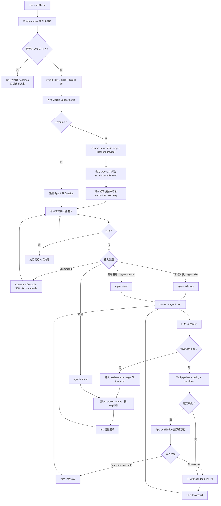
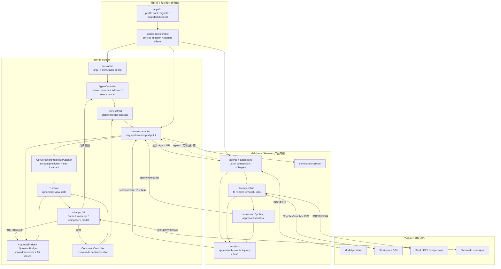
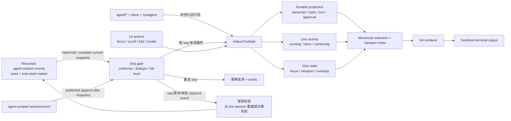
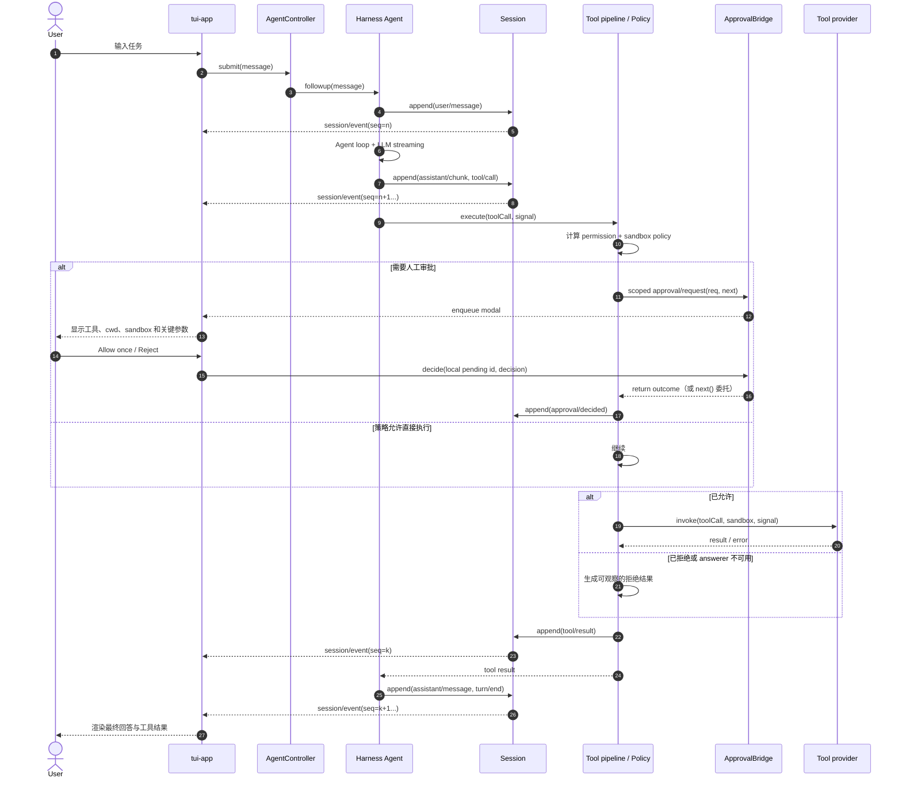
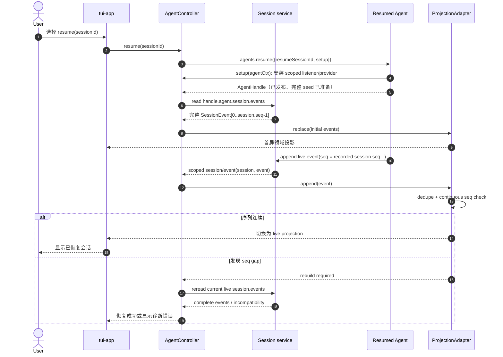
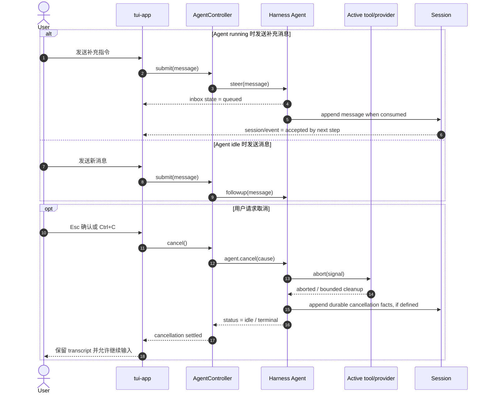
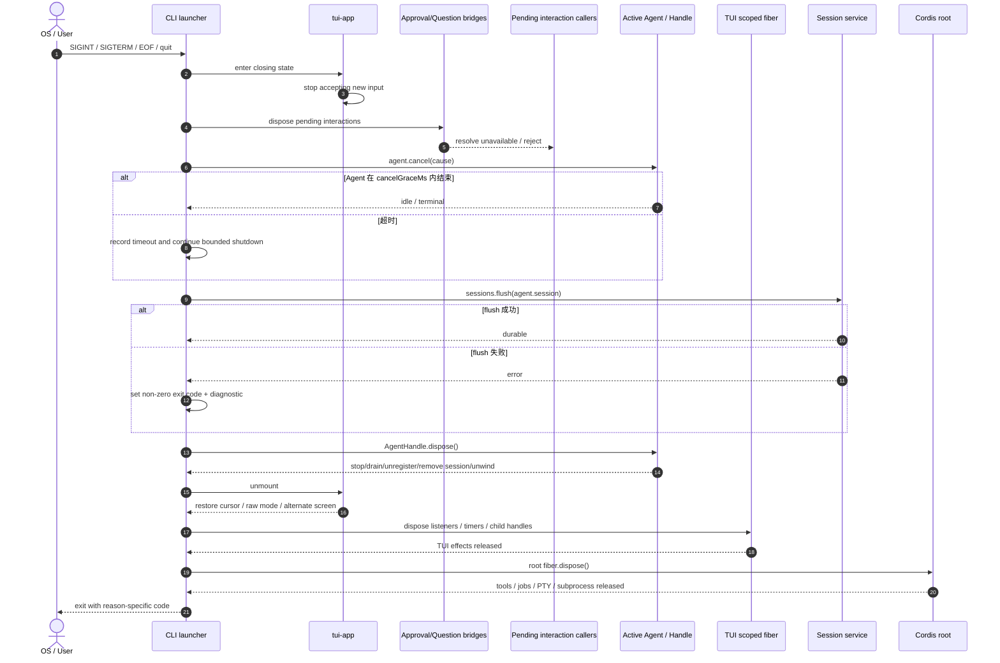
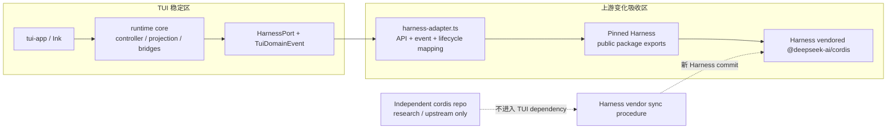

# 基于 DeepSeek Harness 与 Cordis 的 Code Agent TUI 执行方案

> 文档状态：可执行设计稿  
> 编制日期：2026-08-14  
> 源码基线：`opensource/deepseek-harness` `47f9438`（公开包 `0.1.0-rc.5`，session format `0`）；Harness vendored Cordis `56b3d4f`；独立 Cordis `8cc9e33`
> 目标：在保留 DeepSeek Harness 插件体系、Agent loop、会话日志、工具流水线和安全策略的前提下，构建一个键盘优先、面向真实代码仓库工作的交互式 TUI 产品。

## 0. 执行摘要

建议将产品实现为 DeepSeek Harness 的一个**同进程 TUI profile**，而不是重新实现 Agent loop，也不是在第一版中通过现有 SDK 启动一个外部 Harness 子进程。

最终运行形态：

```text
dsh --profile tui [--resume <session-id>] [--model <route>] [--permission <mode>]
  -> dsh-base
  -> dsh-tui bundle
  -> tui-startup（参数解析）
  -> tui-runtime（会话控制、事件投影、审批桥接）
  -> tui-app（Ink 渲染与输入）
```

核心选择如下：

| 决策 | 选择 | 原因 |
|---|---|---|
| 集成方式 | 同进程 Cordis 插件 | 可直接驱动 `ctx.agents`，订阅完整事件并响应审批；避免扩展当前缺少取消和审批的 SDK 协议 |
| TUI 技术 | TypeScript + React + Ink | 与仓库 Node/TS 技术栈一致，支持声明式组件、键盘输入、测试渲染和 npm 分发 |
| Agent 内核 | 原样复用 Harness | 不复制 loop、session、LLM、tools、compaction、subagent |
| 状态权威 | `SessionEvent` 日志 | transcript、恢复和 UI 统一从持久事件重建；实时 `agent/*` 只补充运行态 |
| 安全默认值 | `workspace-write + ask` | 与 `dsh-base` 一致；审批不可用时拒绝，不能降级为自动放行 |
| Cordis 用法 | 组合、作用域、依赖、effect 生命周期 | Cordis 不作为 OS 沙箱、持久工作流或 UI store |
| 首版范围 | 单工作区、单前台主会话、可观察子 Agent | 先保证代码修改闭环、恢复、安全与终端兼容性 |

第一版成功标准不是“在终端里复刻 Web UI”，而是打通以下代码工作闭环：

1. 在当前 Git 仓库启动，识别工作区和指令文件。
2. 创建或恢复会话，流式展示回答、推理摘要、工具调用和 diff。
3. 用户能随时补充消息、steer、取消当前执行，并清楚看到 Agent 状态。
4. Shell、文件写入和提权请求有明确审批；拒绝后 Agent 能继续工作。
5. 退出后会话可恢复，异常退出不留下 PTY、子进程、监听器或未刷盘事件。
6. Linux/macOS 达到发布质量，Windows 至少完成兼容性验证和明确降级提示。

## 1. 产品定义

### 1.1 目标用户

- 主要用户：长期在终端、Git、编辑器和远程开发环境中工作的工程师。
- 次要用户：希望在 SSH、容器、无桌面环境中使用代码 Agent 的团队。
- 不以第一次接触命令行的用户为 P0 目标；但错误信息、权限提示和帮助必须自解释。

### 1.2 核心任务

- 理解仓库：搜索代码、读取文件、解释架构、定位缺陷。
- 修改代码：先读后改、展示 diff、执行格式化、测试和静态检查。
- 调试问题：运行命令、持续观察输出、终止后台任务、读取日志。
- 代码评审：按严重度展示发现，提供文件定位，不自动修改。
- 计划与执行：在 plan 模式形成可审查方案，切换回执行模式后落地。
- 长任务：展示 todo、子 Agent、token、上下文压缩和当前阻塞点。

### 1.3 P0、P1、P2 范围

| 阶段 | 纳入 | 不纳入 |
|---|---|---|
| P0 | 新建/恢复会话、流式对话、工具卡片、Shell 输出、diff、审批、ask-user、steer、取消、模型/权限模式、会话持久化、命令面板、日志诊断 | 多工作区并行、鼠标优先 UI、远程协作、插件市场 |
| P1 | 会话选择器、全文搜索、文件提及、图片附件、PTY 面板、子 Agent 详情、主题、自定义键位、复制/导出、自动更新 | 团队共享会话、云同步 |
| P2 | 多会话并发、远程 runner、SSH workspace、插件管理 UI、团队策略、企业审计导出 | 在 TUI 内建设完整 IDE |

### 1.4 明确不做

- 不 fork 一套新的 Agent 状态机。
- 不让 TUI 直接执行 Shell 或直接写工作区；它只驱动 Harness 能力。
- 不把 Cordis `ctx.effect()` 当成撤销外部写入的事务机制。
- 不默认展示模型私有 chain-of-thought；展示可持久、可审计的文本、工具和状态事实。
- 不在 P0 实现内置代码编辑器；用户可从文件定位跳转到 `$EDITOR`。
- 不让 UI 内存状态成为恢复依据。

## 2. 对现有源码的判断

### 2.1 可直接复用的能力

| 产品能力 | 复用模块/机制 | TUI 的职责 |
|---|---|---|
| Agent 生命周期 | `@deepseek-ai/dsh-agent`、`dsh-agent-loop` | create/resume、followup/steer/inject/cancel、状态展示 |
| 持久会话 | `@deepseek-ai/dsh-session`、JSONL persistence | 事件投影、恢复入口、退出前 flush |
| 领域投影 | `dsh-session` surface、`dsh-session-projection`；参考 `dsh-client-runtime` 的 Conversation assembler | 优先消费现有 surface/projection；只为终端布局补充薄读模型，并与 Web projection 做 fixture parity |
| 模型流 | `@deepseek-ai/dsh-llm` 与 provider adapters | 渲染 chunk、用量、错误和 retry 状态 |
| 工具调用 | `@deepseek-ai/dsh-tools` pipeline | 使用工具自己的 `presentCall`/`presentResult` 意图渲染 |
| 文件系统 | `dsh-fs`、`tool-fs`、observation policy | 展示读取范围、版本冲突、diff 和文件定位 |
| Shell | `dsh-shell`、sandbox provider、`tool-bash`/`tool-pwsh` | 终端卡片、退出码、截断/溢出提示、停止后台任务 |
| 持久 PTY | `dsh-terminal` | P1 独立终端面板；所有权仍归 Agent |
| 权限 | `dsh-user-approval`、permission presets、sandbox policy | 实现 `approval/request` 的人机回答器 |
| 用户提问 | `dsh-user-questions`、`tool-ask-user` | 为 runtime root 注册唯一 provider；子 Agent 提问按 Harness 规则不可交互 |
| 计划/Todo | `dsh-plan-mode`、`dsh-todo`、`dsh-goal` | 状态栏和侧栏投影，不自建第二套任务状态 |
| 上下文 | compaction、token meter | 展示容量、压缩发生和失败，不在 UI 拼模型消息 |
| 子 Agent | subagent seam/providers | 展示父子关系、活动状态和结果摘要 |
| 用户命令 | `dsh-commands` | `/` 命令发现、补全和执行 |
| 组合与配置 | Cordis Loader、bundle/profile/patch | 提供 `tui` bundle，并允许用户 patch |

### 2.2 Cordis 的正确使用边界

Cordis 在本产品中解决四类问题：

1. **组合**：TUI、approval answerer、主题、快捷键、工具 renderer 都是插件或注册项。
2. **作用域**：会话/Agent 局部行为挂到 `agent.ctx`，避免跨会话污染。
3. **依赖可用性**：TUI runner 声明注入 `agents`、`sessions`、`commands`、`approval` 等服务，缺失时启动失败而不是静默降级。
4. **实时生命周期**：监听器、raw-mode、resize handler、定时器和后台渲染任务都通过 `ctx.effect()` 注册 disposer，根 fiber 销毁时逆序清理。

Cordis 不解决以下问题：

- Session 的 durable replay；由 append-only `SessionEvent` 负责。
- Shell/文件安全；由 sandbox、policy、approval 和能力 provider 负责。
- 外部副作用回滚；命令已执行、文件已写入或网络请求已发出时，disposer 不能撤销事实。
- UI 状态管理；TUI 使用纯 reducer 和显式 controller，避免把任意可变状态塞进 `ctx`。

### 2.3 为什么 P0 不走 SDK 子进程

当前 JSON-RPC SDK 适合自动化，但不满足完整交互式 TUI：

- 没有 prompt cancel 或 session close。
- automation SDK 没有 Host Web 协议已有的 approval/question 双向交互面；不能把两套协议能力混为一谈。
- `session/prompt` 只返回入队 receipt，结果归属需由 client 自己按 idle 区间判断。
- runtime 的所有 session event 默认无过滤广播，客户端再做作用域过滤。

因此 P0 用同进程插件。P2 若需要远程 runner，再为协议补充 `session/cancel`、`session/close`、`approval.request`、`question.request`、能力协商、协议版本和断线恢复游标，然后复用同一套 TUI reducer。

### 2.4 上游风险

- Harness 和独立 Cordis 都处于 pre-release/active development，API 无稳定承诺。
- 产品仓库应固定 commit，不跟随浮动版本；每次升级单独建立 compatibility PR。
- 不建议同时依赖 `opensource/deepseek-harness/cordis` 和 Harness 自带 `vendor/cordis`。运行时以 Harness vendored Cordis 为唯一版本，独立 Cordis 仅用于源码研究和上游同步。
- 所有对核心循环的改动都应视为最后手段；优先使用已有事件、Service Definition/Provider/Consumer seam 和 profile patch。

### 2.5 OpenCode 与 Claude Code TUI 源码对照

本方案参考两套已有实现的**行为语义、生命周期和回归测试**，不复制它们的完整 UI 框架。对照基线为本仓库内的 OpenCode `3fc5af6dd` 与 Claude Code `5c63574`。

| 参考实现 | 源码证据 | P0 借鉴 | P0 明确不借鉴 |
|---|---|---|---|
| OpenCode renderer 生命周期 | `opensource/opencode/packages/tui/src/app.tsx` | renderer/keymap/listener 统一 acquire/release；SIGHUP 与主动退出只 dispose 一次 | 不引入 Effect runtime、OpenTUI renderer 和 Solid context 树 |
| OpenCode 数据同步 | `opensource/opencode/packages/tui/src/context/sync.tsx` | 增量事件按 ID 幂等合并；恢复/水合期间的 live 更新不被旧 snapshot 覆盖 | 同进程方案不复制 SDK client/server sync store、workspace/router/provider 镜像 |
| OpenCode prompt | `opensource/opencode/packages/tui/src/component/prompt/index.tsx` | submit 防重入，IME 提交前同步最新文本，粘贴在边界统一换行 | 不实现 extmark、frecency、attachment、workspace move 等完整编辑器能力 |
| OpenCode 回归测试 | `opensource/opencode/packages/tui/test/cli/tui/prompt-submit-race.test.ts`、`sync-live-hydration.test.tsx`、`test/app-lifecycle.test.tsx` | 复制“双 Enter”、“旧水合覆盖 live event”、“信号退出重复 dispose”这三类故障模型 | 不复制其测试 fixture 框架，用 Harness fake provider/session 表达同样不变量 |
| Claude Code 输入处理 | `opensource/claude-code-main/src/hooks/usePasteHandler.ts` | paste-pending 使用同步 ref，避免“粘贴与 Enter 同 stdin batch”丢文本；不为 paste 另挂竞争 stdin listener | P0 不做图片剪贴板读取、截图识别和平台特殊分支 |
| Claude Code 长对话 | `opensource/claude-code-main/src/components/VirtualMessageList.tsx`、`src/ink/components/ScrollBox.tsx`、`src/ink/hooks/use-terminal-viewport.ts` | sticky-bottom 与用户滚动解耦；视口外动画停止；历史前插保持锚点 | P0 不复制 Yoga 节点、自定义 virtual scroll、命中测试和鼠标选择系统 |
| Claude Code 终端 renderer | `opensource/claude-code-main/src/ink/screen.ts`、`output.ts`、`render-to-screen.ts`、`components/AlternateScreen.tsx` | alternate screen/raw mode/cursor 必须成对恢复；信号路径也要有终端保险清理 | 不 fork Ink，不自研 cell buffer、damage diff、reconciler、terminal query 和 ANSI parser |

对照结论：OpenCode 的当前 TUI 是 `@opentui/solid` + 独立 SDK 同步层 + 插件 runtime，Claude Code 则已经深度定制 Ink 的布局、屏幕缓冲、滚动和输入栈。两者都适合作为边界案例，但都不适合成为本项目 P0 的代码模板。

### 2.6 轻量化约束

P0 必须遵守以下限制，避免 TUI 本身演变成第二个产品内核：

1. 保持 `React + 官方 Ink`，不同时引入 Solid/OpenTUI，不 fork 或替换 Ink renderer。
2. 只保留一个 `AgentController`、一个终端专用的薄 projection adapter 和一个 view store；不复制 SDK mirror store、router 或完整客户端领域模型。
3. P0 不提供 TUI 插件 API。Tool renderer 消费 `dsh-tools` 的 `presentCall`/`presentResult` 产出的 card intent（包括 `generic`、`terminal`、`diff`、`locations` 等），不建立第二套动态 UI 扩展系统。
4. 长对话先用 `maxRenderedEvents` + 分段窗口 + sticky-bottom，不实现通用变高 virtual list、自定义 Yoga 布局或 screen-cell diff。
5. P0 不做鼠标交互、选区、音频、图片、动画框架、TUI 内 Git/MCP/LSP 仪表盘；这些不得以“顺手”方式进入 P0 PR。
6. 只有阶段 0 基准证明官方 Ink 无法达到第 9.3 节的指标，才启动 renderer 替换 ADR；替换不得与 P0 功能开发同时进行。

### 2.7 上游更新的兼容策略

“上游更新对 TUI 没有影响”不是可信的技术承诺。Harness 当前是 pre-release，其仓库规则明确不对 API 和 session format 提供稳定承诺。本项目能保证的是：**未验证的上游更新不进入 TUI 发布物；已验证更新的改动被限制在一个薄适配层。**

#### 2.7.1 单一 Cordis 来源

- 产品运行时只使用 `opensource/deepseek-harness/vendor/cordis` 对应的 `@deepseek-ai/cordis`，它与 Harness commit 作为一个不可拆分的兼容单元。
- `deepseek-harness/cordis` 独立仓库仅用于研究和上游同步，不出现在 TUI 的 dependency、workspace link 或 lockfile 解析结果中。
- 需要升级 Cordis 时，必须先按 Harness `vendor/README.md` 流程同步到 Harness vendor，再以该 Harness commit 升级 TUI；禁止 TUI 单独升级 Cordis。
- CI 验证运行时依赖闭包中只有一份 `@deepseek-ai/cordis`；出现第二实例直接阻断构建。

#### 2.7.2 反腐适配层

TUI 内部定义稳定且最小的 `HarnessPort`，只暴露当前 UI 真正使用的操作与事件：

```ts
interface HarnessPort {
  create(input: CreateAgentInput): Promise<AgentHandle>
  resume(sessionId: SessionId): Promise<AgentHandle>
  listSessions(signal?: AbortSignal): Promise<readonly SessionSummary[]>
  subscribeSession(handle: AgentHandle, handler: (event: TuiDomainEvent) => void): () => void
  snapshot(handle: AgentHandle): readonly TuiDomainEvent[]
  projectCapabilities(handle: AgentHandle): TuiProjectionValues
  presentTool(handle: AgentHandle, event: TuiToolEvent): TuiToolView | undefined
  listCommands(handle: AgentHandle): readonly TuiCommand[]
  executeCommand(handle: AgentHandle, line: string, signal: AbortSignal): Promise<TuiCommandResult | undefined>
  answerApprovals(handle: AgentHandle, handler: ApprovalHandler): () => void
  provideQuestions(handle: AgentHandle, handler: QuestionHandler): () => void
  flush(handle: AgentHandle): Promise<'durable' | 'no-persistence-listener'>
}

interface AgentHandle {
  readonly agentId: AgentId
  readonly sessionId: SessionId
  followup(message: UserInput): void
  steer(message: UserInput): void
  cancel(cause: TuiCancelCause): void
  whenIdle(): Promise<void>
  dispose(): Promise<void>
}
```

- `TuiDomainEvent` 是 UI 所需的内部鉴别联合，不向 app 透出 Harness `SessionEvent` 的全部类型面。
- 只有 `runtime/src/upstream/harness-adapter.ts` 和 TUI bundle 入口允许 import `@deepseek-ai/dsh-*` 与 `@deepseek-ai/cordis`；projection、controller contract 和 Ink app 禁止直接 import 上游包。
- adapter 内部必须持有上游 `AgentHandle`，禁止只保存裸 `Agent`。它负责将 create/resume/cancel、session event、approval/question 和 tool presentation 映射为 TUI 内部语义，并确保 owner 最终调用一次 `AgentHandle.dispose()`。
- `snapshot()` 映射当前 `agent.session.events`；`flush()` 映射 `ctx.sessions.flush(agent.session)` 并处理其 boolean 返回值。不得臆造 Harness 不存在的 session-id replay/flush API。
- adapter 不吞异常、不伪造缺失能力、不把未知 required event 降级成 generic row。无法无损映射时，编译、启动或恢复必须 fail loud。

#### 2.7.3 兼容性分层

| 层级 | 防护方式 | 发现不兼容时的行为 |
|---|---|---|
| 依赖层 | 精确 Harness commit/version + lockfile；Harness 携带的 vendored Cordis 不单独漂移 | 保持现有版本，禁止自动合并 |
| 编译层 | adapter-only upstream imports；strict typecheck；执行 package exports/config/catalog verifier | 升级 PR 失败，在 adapter 显式修复 |
| 组合层 | 真实 Cordis Loader + TUI profile 启动，验证必需 service 注入、作用域和 dispose | 拒绝发布，不通过 optional injection 静默跳过 |
| 行为层 | create/resume/followup/steer/cancel、approval fail-closed、question、flush 的黑盒契约测试 | 拒绝发布，对应 adapter 改动必须审查 |
| 事件层 | 使用新 Harness 生成 fixture，与 TUI 投影不变量比较；unknown required event 为硬错误 | 增加显式 mapping 与 fixture，不做 catch-all |
| 持久化层 | 用上一已发布版本的 session corpus 尝试 query/resume/flush | 上游不支持旧格式时，必须提供 migration/export 或明确阻断升级 |
| 产物层 | packed install、单 Cordis 实例、NodeNext consumer、Linux/macOS PTY smoke | 任一门禁失败都不生成可发布 tag |

该策略保护的是 TUI 发布稳定性，不是对上游任意 commit 的源码兼容性。对 pre-release Harness，“升级失败就保留已验证基线”是正常的运维状态。

### 2.8 源码审阅结论与方案修正

本节是对 `opensource/deepseek-harness` 各核心、interaction、session、client、boot 包以及 vendored Cordis 的实现核对结果。以下问题若不修正，会导致 TUI 与真实 API 不匹配，或重复建设现有客户端语义。

| 严重度 | 原方案问题/不足 | 源码事实 | 修正后的约束 |
|---|---|---|---|
| 高 | 将 create/resume 结果当成可随意重建的 Agent 引用 | `ctx.agents.create/resume()` 返回有所有权语义的 `AgentHandle`；只有 handle owner 能完整 stop、drain、unregister、移除 session 和释放 scoped world | adapter 必须保留 handle；正常退出、启动失败回滚和信号退出都 exactly-once `handle.dispose()` |
| 高 | 恢复依赖不存在的 `replay(sessionId, throughSeq)` 与“高水位读取”API | persistence 在 `agents.resume()` 内 prepare 完整 seed；恢复事件位于 `agent.session.events`，constructor seed（包括可能新增的 `session/end-seed`）不发布 `session/event`；`firstLiveSeq` 只是构造事实，不是可订阅游标 | 在 resume 的 `setup` 中安装 scoped listener，返回后从完整 `session.events` 建初始投影并记录当时 `session.seq`，再接收 live tail；按 seq 校验/去重，不发明 query API |
| 高 | 新建完整 `SessionProjection` 可能复制 Web 客户端的 Conversation 语义 | `dsh-session` 已有 surface fold，`dsh-session-projection` 已有 eager projection registry；`dsh-client-runtime` 还有 ConversationNodeAssembler、partial、tool-call tree、queue 和 history window | P0 先复用 surface/projection 值并只实现终端薄适配；对必须自行折叠的对话节点建立与 Web snapshot 的同 fixture parity。不得整体引入 browser Host/React/Zustand runtime |
| 高 | 默认认为子 Agent 可弹 ask-user modal | `UserQuestionService.ask()` 只允许 exact live runtime root；owned child 明确抛 `DELEGATED_CALLER` | provider 只服务 root；子 Agent 必须在结果中回传未决问题，TUI 展示阻塞/结果，不为 child 创建悬挂 modal |
| 中 | 将 approval 描述为普通 provider 注册 | `approval/request` 是 agent-scoped Cordis waterfall；answerer 返回 outcome 认领，或调用 `next()` 委托；异常/缺失 answerer 归一为 `unavailable` | 使用 `agent.ctx.on('approval/request', (req, next) => ...)` 的 scoped answerer；非本 TUI 所有的请求必须 `next()`，dispose/abort fail closed |
| 中 | `flush(sessionId)`/`sessions.flush()` 签名与返回语义错误 | 唯一入口是 `ctx.sessions.flush(session): Promise<boolean>`；false 表示没有 durability listener 参与 | adapter 传 live Session，并把 false 暴露为可诊断的 `no-persistence-listener`；发布 profile 将其视为配置错误 |
| 中 | cancel/followup/steer 被统一写成 Promise | `agent.cancel(cause)`、`followup(message)`、`steer(message)` 均同步入队/发信号；完成边界是 `whenIdle()` | controller 不 await 入队调用；仅在 cancel/关闭协调时 await `whenIdle()`，并传稳定的 cancel cause |
| 中 | slash command 可能绕开官方 runtime | `ctx.commands.list(agent)` 提供有效 scoped descriptors，`execute(agent, line, signal)` 负责解析、执行和持久 command lifecycle | TUI 只做发现与呈现；执行必须调用 `commands.execute`，不得直接调用 handler 或自行追加 command event |
| 中 | 把 `dsh-agent-tool-presentation` 当作 UI render 服务 | 该包只选择模型看到的 `native/code/both`；真正的 UI card intent 定义在 `dsh-tools` 的 tool definition 上 | TUI 从有效 tool definition/result envelope 消费 `presentCall`/`presentResult`，选择模式仍由 preset/profile 负责 |
| 中 | 默认假定存在 read-only permission preset | `dsh-permission-presets` 默认表只有 `workspace-write` 和 `danger-full-access`；`read-only` 是 sandbox mode，不是默认 preset | TUI profile 若承诺 read-only，必须显式配置第三个 preset；选项从 `permissions` projection/Service 读取，不能硬编码 |
| 中 | 假定独立 Cordis 与 Harness vendor 可互换 | Harness vendor 已 rescope，并包含 lifecycle、Loader/Include/HMR 等大量本地加固 | 运行时只链接 Harness vendor；升级以 `vendor/README.md` manifest、local modifications 和测试流程为准，不能直接覆盖独立仓库源码 |

#### 2.8.1 投影复用决策

现有 `dsh-client-runtime` 不能在 P0 被整体复用：它是 Host Web 协议的浏览器侧 object layer，依赖 client connection、api proxy、React、Zustand 和 slots，直接引入会违反轻量化目标。也不能完全忽略它，因为其 Conversation assembler 已编码 tool tree、partial assistant、compaction、retry、history window 和位置索引等语义。

采用两阶段策略：

1. P0 直接使用 `Session.surface`、`sessionProjections.snapshot(session)`（存在该可选 service 时）和工具 presentation intent；对 transcript 只实现当前首屏所需的窄 projection adapter。
2. 用同一组 SessionEvent fixture 同时驱动 Web Conversation snapshot 与 TUI adapter，比较顺序、call/result 配对、interrupted、compaction 和 required-event 拒绝行为。
3. 若 parity 证明仍需复制超过两类复杂 node definition，则停止扩写 TUI reducer，先向 Harness 提取一个不依赖 Host/React/Zustand 的 surface-neutral conversation projection 包；该提取是独立上游任务，不把完整 Web runtime 塞进 TUI。

第 2 项只允许作为测试/fixture 生成步骤，`dsh-client-runtime` 和 `ui-conversation` 不进入 TUI 的生产依赖闭包。工具 intent 的同进程映射应复用 `host/apiproxy` 的 `viewFor` 语义：按 Agent scope 查有效 ToolDefinition，解析 call args，给 result 配对原 call，presenter 异常或配对缺失时软降级 generic。

#### 2.8.2 上游源码覆盖范围

审阅与升级门禁至少覆盖以下 owner 边界，而不是只看 package 名称：

| 边界 | 必审内容 |
|---|---|
| Agent/Session | create/resume setup publication、handle ownership、cancel convergence、SessionEvent envelope/surface、flush/persistence |
| Tools/Security | tool execution pipeline、presentation callbacks、sandbox/policy、approval audit 与 fail-closed |
| Interaction | commands scoped layers、user-questions root restriction、permission preset 持久状态 |
| Client semantic reference | runtime conversation assembler、partial/tool tree/queue、ui-conversation snapshot builder 与 approval panel |
| Boot/Packaging | app-boot profile、bundle catalog、workspace group、exports/files、packed install |
| Cordis | Context scope、effect/fiber teardown、waterfall、Loader settle，以及 `vendor/README.md` 全部 local modifications |

关键证据入口包括：`packages/core/agent/src/{index,runtime-types}.ts`、`packages/core/session/src/{index,types,surface}.ts`、`packages/core/tools/src/{index,presentation}.ts`、`packages/interaction/{user-approval,user-questions,commands,permission-presets}/src/`、`packages/session/session-projection/src/`、`packages/session-query/session-query/src/`、`packages/client/runtime/src/client/sessions/`、`packages/client/ui-conversation/src/client/conversation-nodes/`、`packages/host/apiproxy/src/api-proxy.ts`、`packages/boot/app-boot/src/profile.ts` 与 `vendor/README.md`。实现 PR 应引用对应源码契约及其测试，不以本文接口示例替代上游类型检查。

## 3. 用户体验设计

### 3.1 启动命令

```bash
# 在当前目录创建新会话
dsh --profile tui

# 带初始任务启动
dsh --profile tui "修复登录模块的竞态并运行相关测试"

# 恢复指定会话
dsh --profile tui --resume <session-id>

# 只读评审
dsh --profile tui --permission read-only "review current changes"

# 临时覆盖配置
dsh --profile tui --patch ./team-policy.patch.yml
```

参数归属必须保持现有 launcher 规则：`--profile`、`--patch` 属于 `dsh`；第一个未识别 token 之后的 `--resume`、`--model`、`--permission`、任务文本属于 `tui-startup`。

### 3.2 主界面

```text
┌ repo: uworker  branch: feature/tui  model: deepseek-v4  mode: workspace-write ┐
│ Session: 修复并发写入问题                         ctx 42%   $0.18   running │
├──────────────────────────────────────────────────────────────────────────────┤
│ User  修复 session flush 期间可能丢事件的问题，并运行相关测试                │
│                                                                              │
│ Agent 我先检查 flush 和事件提交的所有权关系。                                │
│                                                                              │
│ ▾ Read packages/core/session/src/index.ts                        8.4 KB       │
│ ✓ Search "session/flush"                                        17 matches   │
│ ▾ Edit packages/core/session/src/index.ts                        +12 -4       │
│   @@ ...                                                                     │
│   + await pendingWrites...                                                    │
│ ▾ Bash pnpm vitest ...                                           running 12s │
│   ✓ session flush ...                                                       │
│                                                                              │
├──────────────────────────────────────────────────────────────────────────────┤
│ Plan 2/4   Tools 4   Files +12 -4   subagents 1   approvals 0                │
├──────────────────────────────────────────────────────────────────────────────┤
│ > 补充覆盖 dispose 与 flush 并发的测试_                                      │
└ Enter send · Alt+Enter newline · Esc steer/stop · Ctrl+P commands · ? help ─┘
```

布局策略：

- 高度小于 18 行：隐藏次要状态，只保留 transcript、审批和输入框。
- 宽度小于 80 列：顶栏分两行，工具卡片取消左右布局，diff 不并排。
- 宽度大于等于 120 列：P1 可打开右侧 activity pane，展示 todo、子 Agent、文件变更。
- 非 TTY：不启动交互 UI；有任务时回退 headless 风格，有错误时返回非零退出码。

### 3.3 信息层级

1. **必须立即可见**：当前 Agent 状态、待审批动作、错误、当前输入、工作区和权限模式。
2. **默认展开**：Assistant 正文、短工具结果、diff 摘要、失败命令末尾输出。
3. **默认折叠**：成功的长命令、完整文件内容、重复 tool chunk、子 Agent 中间过程。
4. **诊断视图**：event seq、provider/model、token、retry、compaction、sandbox enforcement、插件错误。

### 3.4 键位

| 键位 | 行为 |
|---|---|
| `Enter` | 发送；有审批时确认当前选项 |
| `Alt+Enter` | 输入换行 |
| `Esc` | 第一次进入 steering/停止提示；再次确认取消当前运行；弹窗中关闭弹窗 |
| `Ctrl+C` | 有选区时复制；运行中第一次请求取消；空闲时退出确认；连续两次强制进入有界关闭流程 |
| `Ctrl+P` | 命令面板 |
| `Ctrl+O` | 展开/折叠当前工具卡片 |
| `Ctrl+D` | 打开当前 diff/文件变更面板 |
| `Ctrl+R` | 会话选择/恢复 |
| `Ctrl+L` | 重绘屏幕，不清空会话 |
| `Tab` / `Shift+Tab` | 焦点在 transcript、activity、input、modal 间移动 |
| `j/k`、`PgUp/PgDn` | 浏览历史；输入框聚焦时保留普通字符输入语义 |
| `?` | 帮助 overlay |

键位应由配置注册表提供默认值并检测冲突；P0 可只允许配置文件覆盖，P1 再做交互式编辑。

### 3.5 核心工作流

#### 新任务

```text
解析参数 -> 验证 TTY/工作区 -> 等待 Loader settle
-> 读取默认 model -> ctx.agents.create(setup)
-> 绑定 scoped listeners -> 输入 task 或等待用户
-> agent.followup(userMessage) -> 投影 session/event -> 渲染
```

#### 中途引导与取消

- Agent running 时发送普通补充，默认调用 `steer()`；空闲时调用 `followup()`。
- UI 必须明确标记“已排队”“已被下一步领取”，分别对应 inbox 实时事件和持久消息事件。
- 取消调用 Harness `agent.cancel(cause)`，再等待 `agent.whenIdle()`；超时进入 handle/root 的有界释放流程，不直接遗留子进程。

#### 审批

```text
tool pipeline -> approval.request(req)
-> TUI scoped answerer 入队 modal
-> 用户选择 Allow once / Reject
-> Promise resolve
-> approval/decided 持久化
-> tool pipeline 继续或返回拒绝结果
```

- 不提供含糊的“始终允许全部”快捷键。
- 若未来加入规则记忆，必须写入显式 policy 配置并展示资源范围，而不是把一次审批变成全局权限。
- TUI unmount、Agent 取消、信号退出或 request signal abort 时，所有未决审批一律 resolve 为拒绝/不可用。
- answerer 必须注册在 `agent.ctx` 的 scoped waterfall 上；不属于当前 root Agent 的请求调用 `next()`，不能抢占其他产品 surface 的 answerer。

#### 用户提问

- TUI 在 root Agent 的 setup 中向 `ctx.userQuestions.registerProvider()` 注册唯一 provider。
- provider 只回答 exact live runtime root 的请求。Harness 对 owned child 返回 `DELEGATED_CALLER` 是有意的防死锁边界，TUI 不尝试绕开。
- 子 Agent 遇到未决问题时应把问题写入最终结果；父 Agent 再决定是否向用户提问。TUI 只展示这个结果链路。

#### 恢复

- 列表通过 `ctx.sessionQuery.listSessions(signal)` 获取 live-preferred records，不扫描并自行猜测 JSONL。
- 调用 `ctx.agents.resume({ resumeSessionId, setup })`，在 unpublished setup 内安装 Agent-scoped listeners/provider；resume 返回后，以 `agent.session.events` 的完整 seed 一次性建立初始投影。
- constructor seed 及构造期 `session/end-seed` 不会发布 `session/event`。resume 返回后折叠当时完整的 `session.events` 并记录 `session.seq`；后续 published append 经 listener 接续。`firstLiveSeq` 只用于解释哪些事件来自本进程构造，不作为 live 起点。adapter 仍按 seq 连续性校验并幂等去重，但不依赖不存在的高水位/replay RPC。
- 如果最后一个 turn 未正常结束，显示“上次运行中断”，由 Harness 的恢复语义决定能否续跑；UI 不伪造 `turn/end`。

### 3.6 端到端执行流程图



流程中的工具执行始终经过 Harness tool pipeline；TUI 只提供输入、审批回答和事件投影，不存在绕过 policy/sandbox 的执行支路。

## 4. 目标技术架构

### 4.1 组件图

```text
┌──────────────────────────── TUI process ─────────────────────────────┐
│ apps/cli: profile boot, signals, bounded root disposal               │
│                                                                      │
│ Cordis root                                                         │
│ ├─ dsh-base                                                         │
│ │  ├─ sessions / persistence / query                                │
│ │  ├─ agents / agent-loop / llm / compaction / subagent             │
│ │  ├─ tools / fs / shell / terminal / jobs                          │
│ │  └─ sandbox / approval / permission / commands                    │
│ └─ dsh-tui bundle                                                   │
│    ├─ tui-startup: argv -> immutable startup config                 │
│    ├─ tui-runtime                                                   │
│    │  ├─ AgentController                                            │
│    │  ├─ ConversationProjectionAdapter (surface/projection first)   │
│    │  ├─ ApprovalBridge / QuestionBridge                            │
│    │  ├─ CommandController / EditorLauncher                         │
│    │  └─ TuiStore (ephemeral view state)                            │
│    └─ tui-app (Ink)                                                 │
│       ├─ AppFrame / Transcript / Composer                           │
│       ├─ ToolCard renderers / DiffView / TerminalView               │
│       └─ ApprovalModal / QuestionModal / CommandPalette             │
└─────────────────────────────────────────────────────────────────────┘
```

下图进一步标出了包边界、调用方向、事件方向和外部信任边界：



依赖规则只向下：`app -> runtime core -> HarnessPort -> harness-adapter -> Harness 公开能力`。Harness 不依赖 TUI，runtime core 不依赖 React/Ink 或上游类型；因此替换终端 renderer 不会改变 Agent 控制、事件投影或安全语义，升级 Harness 也先由 adapter 吸收。

### 4.2 建议目录

遵循 Harness 的 package 分组，不把所有代码塞进 bundle：

```text
packages/
  tui/
    README.md                # 新 package group 的职责、依赖方向与模块图
    runtime/                 # 不依赖 React/Ink；controller、projection adapter、store contracts
      src/
        ports.ts             # TUI 内部 HarnessPort/TuiDomainEvent，不 import 上游类型
        agent-controller.ts
        conversation-projection.ts
        approval-bridge.ts
        question-bridge.ts
        command-controller.ts
        types.ts
        upstream/
          harness-adapter.ts # 唯一允许 import dsh-* 与 Cordis 的 runtime 模块
    app/                     # Ink 组件、键盘路由、终端能力探测
      src/
        index.tsx
        app.tsx
        components/
        renderers/
        input/
        theme/
    startup/                 # TUI 自有 argv 解析与 startup service
      src/index.ts
  bundle/
    tui/
      cordis.patch.yml
      src/index.ts
      package.json
packages/boot/app-boot/src/
  profile.ts                 # 在 PROFILE_TEMPLATES 中登记内置 tui profile
apps/cli/
  package.json               # 声明 dsh-tui bundle 为安装内依赖
```

`pnpm-workspace.yaml` 的 `packages/*/*` 会发现该 group，但仓库模块约定还要求新增 `packages/tui/README.md` 并同步根级模块图。若阶段 0 尚不能证明 runtime/app 之间存在稳定边界，则先在 `packages/bundle/tui` 内建私有模块，验证后再拆包；不要为了目录整齐提前发布不稳定 API。

### 4.3 包职责

| 包 | 允许依赖 | 禁止职责 |
|---|---|---|
| `dsh-tui-runtime` | 默认只依赖 TUI 内部 port/event 类型；仅 `src/upstream/` 可依赖 Harness 公开包与 Cordis | 其他目录直接 import `dsh-*`/Cordis，ANSI 绘制、React 组件、直接 fs/spawn |
| `dsh-tui-app` | runtime、Ink、终端渲染库 | 直接调用 provider、修改 session log、执行 Shell |
| `dsh-tui-startup` | cmdline、schema/参数解析 | 创建 Agent、渲染 UI |
| `dsh-tui` bundle | 上述插件和 patch | 承载复杂业务逻辑 |

### 4.4 状态分层

| 状态 | 来源 | 是否持久 | 示例 |
|---|---|---|---|
| Durable domain state | `SessionEvent[]` | 是 | user/assistant、tool call/result、turn、approval audit、todo、plan |
| Live Agent state | `agent/*` | 否 | running/idle、inbox、当前 request、实时 ownership |
| View state | TUI store | 否 | 焦点、滚动位置、折叠项、modal、命令面板查询 |
| User settings | `ctx.settings`/profile patch | 是 | 主题、键位、默认权限、模型 |

严禁用 live event 推导本应持久的 transcript；严禁把滚动位置写进 session log。

### 4.5 事件投影模型

定义薄 projection adapter；它优先接收 Harness surface/projection，只有 transcript 缺口才折叠原始事件：

```ts
type ProjectionAction =
  | { type: 'replace-seed'; events: readonly TuiDomainEvent[]; nextSeq: number }
  | { type: 'session-event'; event: TuiDomainEvent }
  | { type: 'agent-status'; status: AgentStatus }
  | { type: 'inbox-state'; items: readonly InboxItem[] }
  | { type: 'subagent-state'; value: SubagentView }
  | { type: 'ui'; action: ViewAction }

function projectTuiState(state: TuiState, action: ProjectionAction): TuiState
```

关键不变量：

- session event 按 `seq` 单调应用；相同 seq 幂等，跳号触发从当前 live session 全量重建/诊断，而不是继续猜测。
- `assistant/chunk` 提供实时保真，`assistant/message` 完成最终归并；seed fold 与 live 结束结果相同，并与 Web Conversation snapshot 的顺序/配对语义一致。
- `tool/call` 与 `tool/result` 按 call id 配对；Code Mode 子调用按 `tool/code-dispatch-start`/`tool/code-dispatch` 配对。
- 未完成 tool call 在恢复后显示 interrupted/pending，不能伪装为成功。
- `turn/end` 是一个轮次最终状态；Agent idle 只是实时状态，二者不能互相替代。
- 所有未知且标记 ignorable 的事件保留为 generic diagnostic row；未知 required event 必须拒绝读取并提示版本不兼容。

事件与状态的数据流如下：



恢复一致性依赖 Harness 已公开的 publication 边界：`resume(..., setup)` 的 setup 在 Agent/Session 发布前完成，constructor seed 与构造期 end-seed marker 不产生 `session/event`；因此 listener 可先于 publication 安装，resume 返回后同步折叠完整 `session.events` 并记录下一 seq。setup 只组合能力、不得驱动 Agent。出现 duplicate 时幂等丢弃；出现 gap 或未知 required event 时停止呈现并从当前 live session 全量重建，不能继续显示不完整 transcript。

### 4.6 Tool renderer 注册表

Harness 允许工具通过 `ToolDefinition.presentCall`/`presentResult` 声明 UI card intent（如 `generic`、`terminal`、`diff`、`locations`）。`dsh-agent-tool-presentation` 只决定模型侧的 `native/code/both`，不是 UI renderer registry。TUI 应消费工具产出的 intent，不按工具名称堆 `switch`：

```ts
interface TuiToolRenderer {
  kind: 'generic' | 'terminal' | 'diff'
  renderCall(view: ToolCallPresentation): TuiNode
  renderResult(view: ToolResultPresentation): TuiNode
}
```

- 通用 renderer 是必备 fallback。
- terminal renderer 处理 stdout/stderr、exit code、signal、timeout、lossy/spill file。
- diff renderer 支持 unified diff、文件列表、行号和 `$EDITOR +line file`。
- renderer 必须纯化，不读取文件来“补齐”结果，避免 UI 看到与 session log 不同的事实。

### 4.7 生命周期与关闭

所有以下资源必须注册到 TUI plugin 自己的 fiber：

- `stdin.setRawMode(true)` 的恢复 disposer。
- `SIGWINCH`/resize listener。
- `session/event`、`agent/status`、approval/question listener。
- Ink render instance 的 `unmount()`。
- 未决 modal promise 的拒绝/不可用处理。
- clipboard/editor 子进程句柄。
- debounce、spinner、elapsed timer。

关闭顺序：

```text
停止接收新输入
-> settle 未决审批/提问为 unavailable
-> agent.cancel(cause)，有界等待 agent.whenIdle()
-> ctx.sessions.flush(agent.session)，检查 boolean/异常
-> agentHandle.dispose()（stop/drain/unregister/remove session/unwind scope）
-> 卸载 Ink，dispose TUI effects，恢复 raw mode/cursor/alternate screen
-> root fiber.dispose()（回收其余 tools/jobs/PTY/subprocess）
-> 按原因与 flush 结果设置退出码
```

`AgentHandle.dispose()` 是所有权 capability，不得用 `ctx.agents.get(id)` 取得裸 Agent 后遗漏它。flush 必须发生在 handle 移除 live session 之前；即使 `whenIdle()` 超时，也必须继续尝试 handle/root dispose。要复用 launcher 的 SIGINT/SIGTERM 有界关闭语义，不能在组件中直接 `process.exit()`。

### 4.8 关键时序图

#### 4.8.1 新任务、工具调用与审批



#### 4.8.2 会话恢复与 seed/live 合流



#### 4.8.3 运行中 steer 与 cancel



#### 4.8.4 信号触发的受控关闭



关闭过程的超时只限制等待时间，不改变安全默认值：未决审批必须先拒绝，必须尝试 flush 并释放根 fiber，且 UI 组件不得直接跳过此流程调用 `process.exit()`。

### 4.9 上游兼容隔离图



架构约束由 lint/import-boundary 规则和 package invariant 强制，不只是代码评审约定。`app`、projection、controller 和 bridges 中出现 `@deepseek-ai/dsh-*` 或 `@deepseek-ai/cordis` import 即使构建失败。

## 5. 安全与权限设计

### 5.1 信任边界

```text
不可信：模型输出、工具参数、仓库内容、终端转义序列、插件文本
受控：TUI reducer、tool presentation、policy/approval、sandbox provider
可信宿主：profile boot、凭据服务、session persistence、根生命周期
```

### 5.2 必须实现的防护

- 所有模型/工具文本在写终端前清理控制字符和危险 ANSI 序列；仅允许 TUI 自己产生样式码。
- OSC 8 链接需配置开关，默认仅为本地规范化路径生成；不渲染模型提供的任意 URL escape。
- 粘贴启用 bracketed paste，粘贴内容永不因包含换行而自动发送。
- approval modal 展示工具名、原因、工作目录、sandbox mode 和关键参数；超长参数按头尾截断并允许展开。
- 默认 `workspace-write + ask`；sandbox unavailable 时 fail closed，不自动切换 `danger-full-access`。
- 凭据来自 Harness credentials service；不得进入 TUI state dump、日志、session event 或错误上报。
- 打开 `$EDITOR` 前对路径做 workspace/location 校验；参数用 argv 数组传递，不拼 Shell 字符串。
- terminal renderer 对大输出采用有界 ring buffer；完整输出只引用 Harness 已产生的 spill file，不在内存无限累积。
- 插件热重载期间若存在待审批请求，旧 listener dispose 时必须结束该请求，防止悬挂。

### 5.3 权限交互

P0 暴露三个 preset，其中 `workspace-write`、`danger-full-access` 来自默认表，`read-only` 必须由 TUI profile 显式增加：

| 模式 | 文件能力 | 审批 | UI 色彩语义 |
|---|---|---|---|
| `read-only` | 只读 | 需要 | 中性 |
| `workspace-write` | 工作区可写 | 需要 | 默认强调 |
| `danger-full-access` | 不限制文件副作用 | 默认不询问 | 持续高风险标识 |

切换权限必须通过 permission service 写入该 session 的持久 knob events，不能只改顶栏文字。危险模式进入前做一次明确确认；恢复会话时从事件 fold 恢复实际模式。

## 6. 配置与插件模型

### 6.1 `dsh-tui` patch 草案

```yaml
- id: system-prompt
  config:
    persona: >-
      You are a coding agent powered by the {{model}} model.
      Your working directory is {{cwd}}.

- id: hmr
  disabled: true

- id: tools
  config:
    mode: !!js process.env.DSH_TOOLS_MODE

- id: permission-presets
  config:
    defaultPreset: workspace-write
    presets:
      read-only:
        sandbox: read-only
        approval: ask
        name: Read only
        description: Read workspace files; reject writes unless the session preset changes.
      workspace-write:
        sandbox: workspace-write
        approval: ask
        name: Workspace write
        description: Write inside the workspace; wider access requires approval.
      danger-full-access:
        sandbox: danger-full-access
        approval: never
        name: Danger full access
        description: Full file access without approval prompts.

- insert:
    - id: code-runtime
      name: '@deepseek-ai/dsh-code-runtime-worker-thread'

    - id: tui-startup
      name: '@deepseek-ai/dsh-tui-startup'

    - id: tui-runtime
      name: '@deepseek-ai/dsh-tui-runtime'
      inject: [agents, sessions, sessionQuery, sessionProjections, tools, commands, approval, userQuestions, permissionPresets, agentDefaultModel]

    - id: tui-app
      name: '@deepseek-ai/dsh-tui-app'
      inject: [tuiRuntime, tuiStartup]
```

实际 service key 必须以源码导出的名称为准，实施时通过 typecheck 和 config verifier 校正；不要用可选注入掩盖必须能力。

### 6.2 TUI 配置

```ts
interface TuiConfig {
  alternateScreen: boolean
  color: 'auto' | '16' | '256' | 'truecolor' | 'none'
  theme: string
  maxRenderedEvents: number
  maxInlineOutputBytes: number
  cancelGraceMs: number
  editor?: readonly string[]
  keymap: Record<ActionId, readonly KeyChord[]>
}
```

所有可部署调节项进入 schema 并在加载时验证；协议常量、安全上限的硬最小值和事件不变量保持固定。配置错误应在进入 raw mode 前失败。

## 7. 分阶段实施计划

以下按 3 名工程师（2 名核心/后端、1 名前端/TUI）估算；单人实施约需 12 至 16 周，3 人并行约 8 至 10 周完成可发布 P0。

### 阶段 0：技术验证与基线冻结（第 1 周）

交付物：可运行的 spike、ADR、事件样本、依赖决策。

- 固定 Harness/vendored Cordis commit，记录 Node/pnpm 版本。
- 建立 `tui` profile 最小 bundle，验证从 `dsh --profile tui` 启动。
- 用一个临时 runner 直接 `ctx.agents.create()`，发送消息并订阅 `session/event`。
- 验证 Ink 与当前 ESM、Node 22/24、tsdown、TypeScript 6 构建兼容性。
- 验证 raw mode、resize、Unicode 宽度、中文输入法、SSH、tmux、非 TTY。
- 验证 `approval/request` 可由 agent-scoped TUI listener回答，取消时无悬挂 Promise。
- 采集真实 run 的 event fixture：纯文本、并行工具、Code Mode、失败 Shell、diff、compaction、子 Agent、审批拒绝。

退出条件：最小 TUI 能完成“发送任务 -> 允许一次 Bash -> 流式显示 -> 正常退出”，并证明 root dispose 后无子进程。

#### 阶段 0 执行记录（2026-08-14）

当前已完成可合并 spike，但阶段退出门禁仍保持打开，不把尚未执行的终端矩阵记为通过：

- TUI 工程已独立落在仓库根目录的 `packages/dsh-tui`，未修改 `opensource/deepseek-harness` 或 `opensource/cordis`。外置 bundle 通过 profile-local symlink 接入真实 Harness Loader。
- `upstream-compat.json` 固定 Harness `5c63574`、独立 Cordis 参考 `8cc9e33`、Harness `0.1.0-rc.5`、session format 0、Node/pnpm/TypeScript/Ink/React tuple；`scripts/check-upstream.ts` 对关键服务签名做只读 fail-fast 检查。
- `src/harness-adapter.ts` 是唯一上游耦合点；TUI 自有 `contracts`、store、approval queue 和 Ink app 不导入 Harness/Cordis 源码。真实 `AgentHandle` 在 adapter 内保留到 flush 与 dispose 完成。
- 真实 profile smoke 已验证外置 base + TUI 组合、TUI 自有 `--help` 和非 TTY fail-loud。Ink 6.8.0 因实际要求 React 19 被淘汰，当前验证组合为 Ink 5.2.1 + React 18.3.1。
- 对象层测试已覆盖有界事件尾部、store 发布、审批 FIFO、allow-once/reject、AbortSignal cancel 和 unmount unavailable；未决审批不会因 abort/dispose 悬挂。
- 确定性 mock LLM + `node-pty` 已跑通真实“任务 -> 平台 Shell escalation（Windows `pwsh`，其他平台 `bash`）-> y -> tool result -> stream -> flush/dispose -> exit 0”链路；脚本同时验证进程退出且不会遗留等待中的审批。
- 阶段 0 后续矩阵仍未完成 Unicode 终端宽度/手工中文 IME 与 SSH/tmux；Node 22/24、resize/alternate-screen 恢复已在阶段 2 自动化，8 类真实 event fixture 已在阶段 1 补齐。权威状态见 `docs/phase-0-compatibility-matrix.md`。

因此本次结果定义为“阶段 0 最小退出链路与自动化基线完成，扩展终端矩阵和事件样本待补”，不能宣称阶段 0 全部门禁已验收关闭。

### 阶段 1：无 UI 的 TUI runtime（第 2 至 3 周）

交付物：`dsh-tui-runtime`、薄 projection/parity 测试、controller 测试。

- 定义 `TuiState`、`TranscriptNode`、`ToolNode`、`ModalState`、`AgentActivity`。
- 先接入 Session surface/registered projections；只为终端缺失的对话节点实现窄 adapter，并与 Web Conversation snapshot 做 fixture parity。
- 实现 AgentController：create、resume、followup、steer、cancel(cause)、whenIdle、flush、AgentHandle.dispose。
- 实现事件 gap/duplicate/unknown-required 检测和从 live session 全量重建。
- 实现 scoped Approval waterfall answerer 与 root Question provider；child question 明确不进入 modal，所有 pending promise 受 AbortSignal 和 fiber dispose 控制。
- 实现 Commands adapter，区分 `/command` 与发给模型的普通文本。
- 实现工具 presentation adapter，保留 generic fallback。
- 建立 fixture-driven snapshot，不依赖真实 API key。

退出条件：对同一 fixture，逐事件 live append 与一次性 seed fold 得到相等投影，关键节点与 Web snapshot 语义一致；取消、handle dispose 和异常 observer 均不泄漏。

#### 阶段 1 迭代记录（2026-08-14）

阶段 1 已于 2026-08-15 完成关闭；以下记录保留其增量过程与最终验收证据：

- 新增上游无关的 `ConversationProjection` 与 `TranscriptNode`/`ToolNode` contract；projection、store 和 Ink app 均不导入 Harness/Cordis 类型。
- `assistant/chunk` 按 message 合并，持久 `assistant/message` 覆盖 streaming 草稿；覆盖 chunk 无 message id、final 有 id 以及 Unicode 文本，避免 seed/live 产生双份 assistant 节点。
- `tool/call` 与 `tool/result` 按 call id 配对，支持并行完成、失败结果和 `parentCallId`；`turn/end` 到达时仍未完成的工具标记为 `interrupted`。
- seq gate 对完全重复事件幂等，对冲突 duplicate、gap 和未知 required event 暂停投影；`rebuild()` 可从完整事件数组恢复。adapter 为已知但不呈现的事件产生 `ignored` 占位，保留连续 seq，不再静默丢掉 envelope。
- 新增 keyless conversation fixture、6 组 projection 测试与 8 组真实 envelope/恢复/服务契约 adapter 测试，证明逐事件 live append 和一次性 rebuild 深度相等并约束终端节点上限；adapter 以 Harness 的 `KNOWN_SESSION_EVENT_TYPES` 与 envelope `ignorable` 为准区分可忽略和未知必需事件，并从 `message.callId`/`data.error` 读取工具结果。当前 strict TypeScript、26 个测试、上游 tuple、真实 profile、Windows PTY 交互和 `git diff --check` 门禁通过。
- 2026-08-15 补充真实 provider 验证：`check:real` 通过真实 Harness TUI profile 调用 DeepSeek 公网 API，终端收到流式响应，并由临时会话 JSONL 证明实际选择为 `deepseek-official` / `deepseek-v4-pro` / `high`；凭证仅从进程环境读取，不落盘，也不纳入默认 keyless `check`。
- 2026-08-15 完成 live 排序故障自愈：adapter 在 projection 检出 gap 或冲突重复后，从事件回调所属 session 的 authoritative `events` 全量规范化并重建；完整日志恢复为 healthy，不完整日志继续暂停，未知必需语义不触发无意义重建并保持 fail-closed。
- 2026-08-15 完成可复用 `AgentController`：上游中立 port 覆盖 create、resume、followup、steer、typed cancel、whenIdle、flush 与 exactly-once dispose；attach 失败可重试，attach 中 dispose 会等待并释放迟到 handle，teardown 错误不吞。一次性 TUI runner 已改为使用该 controller，adapter 黑盒测试通过真实 Harness runtime 模块核对 create/resume 选项、消息编码、seed rebuild 和持久化调用。
- 2026-08-15 接入真实 Session surface 的 registered projection：controller session 与 TUI store 携带 `ctx.sessionProjections` 的 detached 一致快照，change feed 按精确 Session identity 过滤；create/resume 均发布 seed/current snapshot，订阅或首次 observer 失败会回滚 projection listener 与 AgentHandle。Web Conversation assembler 属于未挂载的 client registry，终端 transcript 暂保留薄 fold，不把客户端实现错误当作宿主服务复用。
- 2026-08-15 从固定 Harness checkout 纳入 8 类原始 session fixture：text、parallel tools、Code Mode、failed shell、diff、compaction、subagent、approval rejected。每个 fixture 均验证逐事件 live append 与一次性 seed rebuild 深度相等；Code Mode 的父子调用、失败结果与 Web `ui.expected.md` 关键语义一致，并修复 `message.source.callId`、嵌套 `isError`、`data.meta` 等真实持久化形状。
- 2026-08-15 完成 Commands、Question 与 tool presentation adapter：普通文本只走 Agent followup，slash command 只走精确 Agent 的 `ctx.commands.execute()`，unknown/malformed command 不穿透模型；root Question provider 只接受 exact root，child 明确拒绝且 FIFO/abort/dispose 无悬挂；工具 presenter 通过有效 definition 软调用 `presentCall`/`presentResult`，未知 card、缺失或抛错均降级 generic。
- 阶段 1 退出条件已满足：8 组真实 fixture 的 live/seed 投影相等，关键 Code Mode 节点与 Web snapshot 语义一致；controller cancel/dispose、attach failure、异常 observer、approval/question teardown 均有自动化覆盖。关闭时严格 TypeScript 与 39 项 runtime 测试通过，随后阶段 2 首个纵切将总数扩展为 41 项。

### 阶段 2：主界面与输入系统（第 3 至 5 周）

交付物：可日常使用的单会话 TUI。

- 实现 AppFrame、header、transcript viewport、composer、status line。
- 输入支持多行、历史、bracketed paste、IME，不误触发送。
- 实现 focus/key routing，modal 优先消费按键，避免全局快捷键穿透。
- 实现增量渲染、自动跟随底部、用户向上滚动后暂停跟随、未读计数。
- 实现文本、错误、turn/step 分隔、streaming cursor。
- 实现命令面板与 `/help`、`/new`、`/resume`、`/model`、`/permission`、`/compact`、`/quit` 的发现入口；真实命令仍由 `ctx.commands` 执行。
- 实现窄屏/低高度降级和无色模式。

退出条件：在 80x24 和 160x50 下完成 30 分钟会话，无明显闪烁、重排错误或输入丢失；10000 个事件的恢复保持可交互。

#### 阶段 2 迭代记录（2026-08-15）

已完成主界面与输入系统的第一个可运行纵切，阶段 2 尚未关闭：

- Ink 视图拆出 header、transcript、composer 与 status line；modal 输入优先于 composer，approval 不再发生按键穿透，单问题选项可用数字回答。
- 新增纯 `ComposerState` reducer，覆盖中文/IME 文本块、bracketed paste、多行、Unicode backspace、提交历史与上下浏览；空白输入不发送。
- 新增 opt-in `--interactive` 单会话模式。首任务结束后继续持有同一个 `AgentController`，follow-up 与 slash command 复用阶段 1 adapter，提交后等待 idle 并 flush；本地 `/quit` 等待队列收敛后执行 durable dispose。默认一次性行为保持兼容。
- Windows ConPTY 自动化已扩展为“首任务 -> Shell approval -> stream -> composer follow-up -> 第二次模型请求 -> `/quit` -> exit 0”，并修正 PTY 文本块与 Enter 必须分离注入的测试语义。
- 2026-08-15 完成 transcript viewport 状态机：默认自动跟随底部，PageUp 暂停并按距底偏移保持内容锚点，新行和同一 streaming 行修订均累计未读，PageDown 回到底部清零；终端 resize 会重新计算固定 transcript 高度并夹紧偏移。
- 2026-08-15 接入 exact Agent 的命令目录：composer 输入 `/` 前缀显示最多三项过滤候选，真实命令仍只调用 `ctx.commands.execute()`；本地 `/help` 展示当前命令目录，`/quit` 等待提交队列后退出。命令描述和 Store 快照均做 detached copy。
- 2026-08-15 新增 10,000 event rebuild 自动化以及 80x24、160x50 两组真实 ConPTY smoke；两种尺寸均完成 task、Shell approval、follow-up、`/help`、`/quit` 和 dispose。后续将 seed fold 改为批量折叠、仅在完成/暂停时发布一次 immutable snapshot，10,000 事件所在测试文件由秒级降至约 24ms，同时保持 live 逐事件发布与 fixture parity。当前 strict TypeScript 与 51 项测试通过。
- 2026-08-15 完成结构化 Question modal：一个 provider 请求可逐题处理单选、多选和 Unicode 自由文本/Other，option 光标支持任意长度列表；Queue 在解除 Agent 等待前验证问题覆盖、唯一 id、合法 label、单选基数和非空答案。真实 80x12 PTY 显式挂载官方 `dsh-tool-ask-user`，完成两题回答，并从下一次模型请求体确认 `Careful` 与中文 Other 已作为 tool result 返回。
- 2026-08-15 完成动态终端生命周期验证：160x50 ConPTY 以 alternate-screen 启动，交互中缩至 80x24、确认重绘后发送 follow-up，再恢复 160x50 完成 `/help`、`/quit`；测试断言 `1049h`/`1049l` 进入与恢复序列，证明正常退出后主屏被还原。
- 2026-08-15 新增 `--no-color` 并贯穿 startup -> Cordis config -> Ink renderer；Question PTY 在无色模式下完成全链路，并断言不存在 ANSI 30-37/90-97 前景色码。启动参数测试锁定默认 color、interactive、alternate-screen 的独立语义。当前 strict TypeScript 与 51 项测试通过。
- 2026-08-15 完成低高度行预算：布局按实际 header、transcript、modal/composer、notice/error 和 status 行数分配 viewport；低于 16 行时隐藏次要 detail/reason、将 option/command 窗口收缩为一行，空间继续不足时先移除 status/header。真实 80x12 Question PTY 完成结构化回答、follow-up、`/help`、`/quit` 与无色断言；纯布局测试覆盖 8 行复杂 modal，当前 strict TypeScript 与 55 项测试通过。
- 2026-08-15 建立并跑通可重复的单会话 soak 门禁：`check:soak` 实际运行 30 分钟，持续复用同一 Agent，在 80x24、160x50、80x12 间轮换，共完成 352 次 follow-up 和 352 次 resize、354 次模型请求，处理约 1.31 MB PTY 输出；每轮 watchdog、整体期限、正常 `/quit` 和 alternate-screen 恢复断言均通过。驱动始终只保留 128 KiB 输出尾部。相同状态机的 10 秒 quick gate 已纳入常规 `check`。
- 2026-08-15 完成 Node 22/24 runtime matrix：固定官方 Node v22.23.2，由同一 `process.execPath` 驱动 TypeScript、55 项测试、真实 profile、80x24 approval、160x50 resize/alternate-screen、80x12 Question/no-color 与 quick soak。Node 22 首轮暴露 Question PTY 在 Ink 重绘回调中立即写入会丢失的问题；改为画面检测后延迟 50ms 注入并清理 pending timer 后，完整矩阵通过。系统 Node v24.14.0 常规门禁保持通过。
- 2026-08-16 关闭阶段 2 剩余项：新增 `terminal-text.ts` 统一清理 OSC/CSI/DCS、未终止转义、C0/C1/DEL 与双向覆盖字符，并按 East Asian/emoji/组合字符宽度做截断与换行；`terminal-capabilities.ts` 探测颜色等级、备用屏幕、超链接、tmux/screen、SSH 与旧版 Windows 控制台，并把每一次降级记录为显式 note。
- 2026-08-16 修复此前一直失败的 `--unicode` PTY 场景：Ink 会剥掉每个输入块的前导 ESC，导致 bracketed paste 起始标记以 `[200~` 形式进入草稿。改为在任意位置移除两个标记后，真实 80x24 ConPTY 完成“中文宽字符 + emoji + 组合字符 + 第二行 IME 提交”的粘贴，不提前发送，并从下一次模型请求确认码点无损。
- 2026-08-16 修正 composer 行预算：多行草稿按实际换行占用向 `terminalLayout` 申报行数（compact 下 1 行、否则最多 3 行，超出以 `…` 提示），状态行左右两侧按列宽截断，避免状态行折行破坏固定布局。
- 阶段 2 退出条件已满足：80x24、160x50、80x12 三种尺寸的真实 PTY 场景、30 分钟耐久、Node 22/24 矩阵与 10,000 事件恢复全部通过。SSH/tmux 与 Linux/macOS 终端仿真器矩阵仍未人工执行，已按“未运行”记录在兼容矩阵中，不计为通过。

### 阶段 3：代码工具体验（第 5 至 6 周）

交付物：代码任务闭环。

- generic、terminal、diff 三类 renderer。
- Shell 卡片显示 command、cwd、sandbox、elapsed、exit code、尾部输出、截断状态。
- diff 支持 unified view、按文件折叠、增删统计、二进制提示和路径定位。
- 文件 read/search 展示范围、匹配数和 location；支持调用 `$EDITOR`。
- Todo/plan/goal 在状态栏和 activity panel 投影。
- Code Mode 的嵌套子调用在父工具下展示，按子 call id 配对。
- 子 Agent 只显示结构化状态、工具摘要与最终结果，默认不灌入主 transcript。

退出条件：用户能在不离开 TUI 的情况下理解 Agent 读了什么、改了什么、命令是否成功、哪个文件可打开。

#### 阶段 3 执行记录（2026-08-16）

- 卡片一律由工具自己声明的 render intent 生成：`tool-card.ts` 消费 `presentCall`/`presentResult` 产出的 `generic`、`terminal`、`diff`、`search`、`read`、`web`，不按工具名分支；intent 缺失、未知或抛错时统一降级 generic，且异常不会影响 transcript。
- terminal 卡片展示 command、cwd、description、`exit N`/`signal X`/`running`/`interrupted`，失败默认保留输出尾部；输出同时受行数与字节上限约束，超出部分显式标记为 `… N more line(s) not shown (output capped)`，10 MB 输出实测 12ms 且内存有界。
- `diff-view.ts` 以带守卫的 LCS 生成带上下文的 unified hunk、行号、增删统计、新建文件与二进制提示；超过单元格上限时降级为整文件替换而不是阻塞渲染。
- search（matches/paths 两种 shape）、read（行号窗口 + `showing N of M`）、web（sources/HTTP 状态）均有专用徽标与 location 输出。
- `transcript-view.ts` 统一折叠策略：成功且较长的工具卡片默认折叠，失败保持展开，reasoning 默认折叠，Code Mode 子调用按 parent call id 缩进挂到父卡片下；`Ctrl+O` 折叠当前可见卡片，`Ctrl+E` 打开该卡片第一个 location。
- `editor-launcher.ts` 先做 workspace 越界校验，再以 argv 数组启动编辑器，拒绝含 shell 语法的 `$EDITOR`，绝不拼接命令行；vim/code/idea/subl 等按各自的行号参数族生成。
- `activity.ts` 从已注册 Session projection 折叠权限 preset、plan、todo、token、context 压力与子 Agent，写入状态行；TUI 不维护第二套任务状态。
- 为避免每次事件重建全部卡片，`buildTranscriptEntries` 支持按节点签名缓存，仅重建发生变化的节点。

### 阶段 4：权限、恢复与故障处理（第 6 至 7 周）

交付物：安全可恢复 beta。

- 审批 modal、ask-user modal、AbortSignal、队列、公平性和重复请求保护。
- permission preset 切换与危险模式确认。
- session selector、resume、中断状态标记、flush 失败提示。
- Provider 错误、retry、context overflow、compaction、sandbox unavailable 的专用错误行。
- SIGINT/SIGTERM、EOF、terminal detach、renderer crash 的有界关闭。
- 崩溃后恢复终端：cursor、raw mode、alternate screen、bracketed paste。
- 提供 `--diagnostic-log <path>`，日志默认脱敏且不写 stdout。

退出条件：故障注入矩阵全部通过；任何审批 transport 失败都不能执行受限工具；强制中断后终端可立即正常使用。

#### 阶段 4 执行记录（2026-08-16）

- 审批模态框改为绑定被审批的 tool call：adapter 透传 `callId`，UI 展示该卡片标题、首行摘要、asker 原因与当前 preset；仍然没有“始终允许”的快捷键。
- 权限：`cordis.patch.yml` 显式补齐 `read-only` preset（默认表只有 workspace-write 与 danger-full-access）；切换仍只走官方 `/permission` 命令，切到 `danger-full-access` 必须连续发送两次，第一次只出警告。启动参数 `--permission` 在进入 raw mode 前校验，运行时通过官方命令写入，命令被拒即启动失败。
- 恢复：`session-selector.ts` 只消费 `ctx.sessionQuery.listSessions()`，支持 `latest`、完整 id 与无歧义前缀，过滤 subagent 与不可达会话；`/sessions` 展示前 5 条。`executeHarnessTask` 支持 resume 分支、可选首任务与 preset 应用。`scripts/resume-smoke.ts` 用真实 Harness 跑通“新建 -> `/quit` -> `--resume latest` -> 展示旧 transcript -> follow-up -> 恢复历史进入下一次模型请求 -> exit 0”。
- 关闭：`shutdown.ts` 把 quit、Esc/Ctrl+C、SIGINT/SIGTERM 与致命错误收敛为一次有序、精确一次的序列（停止输入 -> 未决交互结算为 unavailable -> cancel -> 有界等待 idle -> 交还给持有者 flush/dispose）；单步抛错不阻断后续步骤，超时只限制等待。`TerminalGuard` 在所有退出路径恢复光标、bracketed paste 与备用屏幕。
- 退出码：完成且已持久化为 0；turn 非正常结束为 1；工作完成但最终 flush 失败或抛错为 74（并写诊断）；取消/信号为 130。flush 始终发生在 `AgentHandle.dispose()` 之前。
- `render-boundary.tsx` 让单个渲染区域崩溃降级为一行错误提示，不影响 Agent；错误同时进入诊断日志。
- `--diagnostic-log` 写脱敏 JSONL：凭据键值替换为 `[redacted]`，prompt/参数/内容/输出只保留形状摘要，深度、数组长度与字符串长度均有上限；绝不写交互 stdout，sink 失败只计数。
- 故障注入矩阵（`tests/fault-injection.spec.ts`）覆盖：answerer 被拆除/abort/缺失、关闭时清空未决队列、flush 返回 false、flush 抛错、turn 非完成、preset 被拒或未知、必需服务缺失，共 7 组断言。
- 组件级虚拟终端测试暴露并修复了一个真实缺陷：Ink 默认在第一次 Ctrl+C 就 unmount，会整体绕过受控关闭。改为 `exitOnCtrlC: false` 后，第一次只是武装确认、第二次才进入关闭序列；`scripts/cancel-smoke.ts` 用真实 PTY 断言 exit 130 与 `?1049l`/`?25h` 恢复。
- 同一批组件测试还覆盖了计划点名的输入回归类型：双 Enter 只提交一次、单块 bracketed paste（含换行）不误提交且内容完整、审批按键不穿透到 composer。
- 补齐 `Ctrl+P` 命令面板（过滤、上下选择、Enter 预填草稿而不是直接执行带参命令）、`Ctrl+R` 会话选择器与进程内 `/new`、`/resume`：当前会话先 flush/dispose，再挂载下一个会话；`check:resume` 已扩展为验证该链路，组件测试覆盖选择器的刷新与选中恢复。
- 已知未做（如实记录）：`Tab` 焦点循环与 ≥120 列的右侧 activity 面板未实现，前者在当前单栏布局下无实际焦点目标，后者属于 P1；两者都不计为已完成。

### 阶段 5：性能、兼容与发布（第 8 至 10 周）

交付物：`0.1.0` 可安装预览版。

- 对 1k/10k/100k events、10 MB tool output、100 个并行 tool calls 做压力测试。
- transcript 有界分段：首屏只构建尾部窗口，向上滚动时按段换入历史，总投影只保留轻量索引；P0 不建通用变高 virtual list。
- 合并 chunk 的刷新频率控制在 30 至 60 FPS；高频事件不逐个触发全树 render。
- Linux/macOS 主支持；Windows PowerShell、ConPTY、路径和 sandbox 降级测试。
- 测试 xterm、iTerm2、Windows Terminal、tmux、screen、VS Code terminal、SSH。
- 产出 npm package、profile template、changelog、迁移说明和 shell completion。
- 增加关键 keyless transcript snapshot；真实 provider e2e 仅作为补充。

退出条件：发布门禁全部通过，安装后首次启动不要求源码仓库，不污染 stdout，升级/卸载不删除用户 sessions/settings。

#### 阶段 5 执行记录（2026-08-16）

- `scripts/bench.ts` 建立可复跑的性能门禁并暴露了两处真实缺陷：投影对每个 tool 配对、文本归并和 turn 结束都做全量线性扫描，且为每个事件保留一份 JSON 指纹。改为 id 索引 + 未决调用集合 + 数值指纹后，100k 事件重建从约 50s 降到 0.32s，10k 从 314ms 降到 40ms，10k 稳态 RSS 为 99.6MB（预算 200MB）。10 MB 输出 12ms、100 个乱序并发调用 21ms。
- 产物边界：新增 `tsconfig.build.json` 生成 `lib/*.js` 与 `lib/types/*.d.ts`（相对 `.ts` 说明符改写为 `.js`）；package `exports` 默认解析 `lib`，开发链路通过 `--conditions=development` 解析 `src`。`scripts/packed-install-smoke.ts` 打包 tarball、在仓库外解包、校验 `files`/`exports` 完整性，并用真实 profile 启动（help + 非 TTY 拒绝）。
- adapter 的上游加载改为“先解析已安装包，再回退到固定源码 checkout”，使已安装形态不再依赖 monorepo 路径。
- `scripts/release-gate.ts`（`npm run check:release`）把静态不变量（不得直接依赖或 import Cordis）、上游 tuple 与服务契约、严格 typecheck、测试、真实 profile、PTY 矩阵、恢复、性能预算、打包安装与耐久 soak 串成一条门禁；`--fast` 只跳过慢门禁并明确声明该次运行不可发布。
- `tests/isolation.spec.ts` 改为扫描全部源码：仅 adapter 允许出现 checkout 路径或 `@deepseek-ai/*` import，非 `.tsx` 模块不得 import React/Ink。
- `check-upstream.ts` 的契约集合扩展到 12 项，新增 agents.resume、sessionQuery.listSessions、SessionRecord 形状、ApprovalRequest 形状、userQuestions.registerProvider、permission-presets 配置与 tool render-intent 词表。
- 交付文档：`docs/tui-user-guide.md`（安装、参数、键位、权限、恢复、退出码、诊断、平台级别）、`CHANGELOG.md`（含完整上游 tuple 与已知限制）、`docs/phase-0-compatibility-matrix.md`（逐项证据，并把未运行项如实标注为 Not run）、bash/zsh/fish 补全及其漂移测试与真实 bash 补全探针。
- 补齐 INT-02 的 steer 语义：普通文本在 Agent running 时直接 `steer()` 并提示“queued for the current step”，不再排到提交队列后面变成普通 follow-up；idle 时仍走 followup 并等待 idle+flush。路由决策抽成纯函数以便单测。
- Node 22 矩阵暴露真实的测试驱动缺陷：在 Ink 重绘期间写入的按键会被丢弃，且 Ink 每帧重绘整屏会让“旧文本”看起来像新响应。PTY 驱动改为按步骤重发直到回显出现，并以模型请求计数（而非屏幕文本）判定新响应；随后 Node 22 全矩阵通过。
- 2026-08-16 全量 `npm run check:release` 十项门禁全绿。
#### 阶段 5 补充执行记录（2026-08-16，第二轮）

- 补齐 `REC-04` 的 EOF：stdin `end`/`close` 进入同一条有界关闭序列，并在组合层用注入的 stdin 验证。
- 新增 `plugin.spec.ts` 组合层测试（13 项）：以真实 plugin/store/队列/controller/adapter + 替换渲染器，覆盖启动拒绝、退出码 0/1/74/130、取消、SIGTERM、stdin EOF、监听器归零、`/new`、选择器恢复、danger preset 二次确认与 steer。
- 补齐 `UI-02` 历史分段换入：窗口先渲染 `maxEvents` 个节点，PgUp 抵达最旧行时按页换入保留的历史（受 retention 上限约束）；换入的历史保持视口锚点且不计入未读。
- 补齐 `UI-04` 的 `Tab` 焦点循环：transcript 焦点下 `j/k`、方向键滚动，`Enter`/`Tab` 回到输入，导航键不会写入草稿。
- 补齐 `QA-01` property test：引入 fast-check，对生成的事件日志验证 seed/live 相等、重复投递幂等、跳号暂停、工具配对、保留上限；对任意二进制字符串验证清理后无转义/控制字符、截断与换行不超列宽、清理幂等。该组 property 直接发现并修复了一个真实缺陷：单个字形宽于整行时换行会溢出一格（1 列终端显示宽字符）。
- 真实安装暴露另一个打包缺陷：peerDependencies 固定了尚未发布的版本，导致 `pnpm install` 直接失败。改为可选 peer 范围（profile 提供这些包，不应阻断安装）。
- 第二轮结束：`check:release` 十项门禁与 Node 22 矩阵均通过，测试总数 160。

#### 真实 API 验证记录（2026-08-16）

凭据与 base URL 从 `.env`（或进程环境）读取，脚本不打印密钥值。

- `check:real`：真实 profile 通过 `https://api.deepseek.com` 流式回答，持久化的 request header 证明实际选择为 `deepseek-official` / `deepseek-v4-pro` / `high`。
- `check:real:interactive`：真实模型调用 `read` 工具读取 package.json、作答、接受 composer follow-up、完成第二轮，`/quit` 退出 0；会话日志含 2 条 user message、2 个 turn/end 与该工具调用。
- `check:real:approval`：`--permission read-only` 下，真实模型的写入先被 sandbox 拒绝（`exit 1`），随后带 `sandbox_permissions: workspace-write` 重试，TUI 弹出 `Approve pwsh? (read-only) [y/N]` 并显示关联卡片与原因；批准后命令 `exit 0`、文件生成、`approval/decided` 落盘、状态行显示 `approvals 1`。
- 真实运行发现并修复了一个真实缺陷：`--permission` 与 `--model` 虽已解析校验，却没有映射进 profile patch 的 plugin config，导致两个参数被静默忽略（首次真实运行时状态行仍显示 `workspace-write`）。
- 真实运行还顺带验证了 provider 错误行：`reasoningEffort` 不受支持时，transcript 显示 `── turn error: UNSUPPORTED_REASONING_EFFORT …` 并以非零码退出。
- 这两个真实 API 门禁属于 opt-in，不进入默认 `check`（需要密钥与网络）。

- 逐条对照 8.2 WBS 后，如实登记以下未完成项（均已写入兼容矩阵的 Still open）：
  - `BOOT-03`/`REL-02` 内置 profile 注册：与 ADR 0001「上游 checkout 只读」冲突，故意不做，改用外置 bundle；正式发布仍需上游补该 profile 模板条目。
  - `TOOL-08` 的右侧 activity 面板（P1）：同源数据已投影到状态行。
  - `REC-04` 的 EOF：已在组合层用注入 stdin 覆盖；`node-pty` 无法在不杀进程的前提下关闭子进程 stdin，因此没有 PTY 级用例。
  - SSH/tmux 人工矩阵、Linux/macOS PTY 与终端仿真器矩阵、基于已发布 Harness 的完整依赖闭包安装：未运行。

## 8. 任务分解与优先级

### 8.1 Task 拆解规则

- 一个 Task 应由一名工程师在 0.5 至 2 人日内完成，超过 2 人日必须再拆。
- “依赖”列表示开始该任务前必须完成的 Task ID；——表示可立即开始。
- “建议角色”是责任类型，不是固定人名：`Core-A` 主负责 Agent/Session，`Core-B` 主负责 Tools/Security/Boot，`TUI` 主负责 Ink/输入/渲染，`Shared` 由当期 owner 领取。
- 每个 Task 对应一个 issue 或 PR 中的一个可独立审查 commit；不使用“完善”、“优化”等无可验收边界的任务名。
- 人日是净工作量，不是日历时间；P0 总量 73 人日，排期另加 20% 上游变更、评审和缺陷修复缓冲。

Task 的统一 Definition of Done（DoD）：

1. 产出物已合并到目标分支，无未解决 typecheck/lint/build 错误。
2. 表中验收点已由自动测试、可重复命令或评审记录证明。
3. 改变用户可见行为时更新 keyless snapshot；改变架构或不变量时更新 ADR/Agent Note。
4. 新增 listener、timer、PTY、subprocess 或 Promise 时，必须有 dispose/abort 路径及泄漏测试。
5. 不降低 `workspace-write + ask`、fail-closed、session event 单调投影等安全不变量。

### 8.2 P0 Task WBS（73 人日）

#### 8.2.1 Boot/Profile（5 人日）

| ID | Task | 产出物与验收 | 依赖 | 建议角色 | 人日 |
|---|---|---|---|---|---:|
| `BOOT-01` | 冻结源码与工具链基线 | ADR 与 `upstream-compat.json` 记录 Harness/vendored Cordis/session format/Node tuple，同时记录 UI 参考 commit | —— | Core-B | 1.0 |
| `BOOT-02` | 建立 TUI package/bundle 骨架 | workspace 能发现 `startup/runtime/app/bundle`，新 package group 的 README/根模块图同步，空插件可 build | `BOOT-01` | Core-B | 0.75 |
| `BOOT-03` | 登记内置 `tui` profile | `PROFILE_TEMPLATES` 与 CLI 依赖完整，`--dump-config` 显示正确组合 | `BOOT-02` | Core-B | 0.75 |
| `BOOT-04` | 实现 TUI argv 与配置 schema | 解析 task/resume/model/permission；非法值在 raw mode 前失败 | `BOOT-02` | Core-B | 1.25 |
| `BOOT-05` | 实现 TTY/终端能力探测 | 覆盖非 TTY、无色、尺寸为 0、alternate screen 降级；有 smoke test | `BOOT-04` | TUI | 1.25 |

#### 8.2.2 Runtime（10 人日）

| ID | Task | 产出物与验收 | 依赖 | 建议角色 | 人日 |
|---|---|---|---|---|---:|
| `RUN-01` | 定义 runtime 状态、`HarnessPort` 与 action contract | TUI 内部类型完整，projection/app 不 import React/Ink 或任何上游 `dsh-*`/Cordis 类型 | `BOOT-02` | Core-A | 1.0 |
| `RUN-02` | 实现薄 conversation projection adapter | 优先消费 Session surface/registered projections；仅对 user/assistant/turn 等终端节点做窄适配，不复制完整 browser runtime | `RUN-01` | Core-A | 2.0 |
| `RUN-03` | 实现 chunk 与 final message 归并 | live 结果与一次性 seed fold 深度相等，Unicode chunk 不损坏 | `RUN-02` | Core-A | 1.0 |
| `RUN-04` | 实现 tool/subcall 配对 | call/result 和 Code Mode dispatch 按 ID 配对；未完成调用标记 interrupted | `RUN-02` | Core-A | 1.0 |
| `RUN-05` | 实现 seq gate 与全量重建 | duplicate 幂等，gap/未知 required event 暂停呈现；可从 live `session.events` 重建且不会以旧数据覆盖 live tail | `RUN-02` | Core-A | 1.5 |
| `RUN-06` | 实现 Harness adapter 与 `AgentController` | adapter 是唯一上游 import 点；保留真实 AgentHandle，映射同步 followup/steer/cancel 与 whenIdle/flush/dispose，scoped listener 在 setup 中安装 | `BOOT-04`, `RUN-01` | Core-A | 2.0 |
| `RUN-07` | 建立 event fixture 与 projection parity | 覆盖文本、并行工具、diff、Shell 失败、compaction、subagent、approval、Code Mode；关键节点与 Web Conversation snapshot 语义一致 | `RUN-03`, `RUN-04`, `RUN-05` | Core-A | 1.5 |

#### 8.2.3 Rendering（12 人日）

| ID | Task | 产出物与验收 | 依赖 | 建议角色 | 人日 |
|---|---|---|---|---|---:|
| `UI-01` | 实现 AppFrame 和响应式布局 | header/transcript/status/composer 在 80x24、160x50 及低高度下无重叠 | `BOOT-05`, `RUN-01` | TUI | 1.5 |
| `UI-02` | 实现 transcript 分段窗口 | 用 `maxRenderedEvents` 渲染尾部，向上按段换入并保持锚点；10k fixture 首屏可交互，不自研 virtual list | `UI-01`, `RUN-07` | TUI | 2.0 |
| `UI-03` | 实现多行 composer | Enter/Alt+Enter、history、bracketed paste、IME 和草稿保留通过测试；submit 防重入，paste+Enter 同 batch 不丢文本 | `UI-01` | TUI | 2.0 |
| `UI-04` | 实现 focus 与 key routing | modal 优先、Tab 循环、输入语义不被全局键穿透 | `UI-01`, `UI-03` | TUI | 1.5 |
| `UI-05` | 实现 transcript 基础行 | user/assistant/error/turn/step/streaming cursor 可渲染，renderer 异常有 fallback | `UI-02`, `RUN-03` | TUI | 1.5 |
| `UI-06` | 实现 sticky-bottom 与未读计数 | 底部时新内容自动跟随，手动上滚立即解耦，历史前插保持锚点，返回底部清除未读 | `UI-02` | TUI | 1.0 |
| `UI-07` | 实现状态行与命令面板 | 展示 Agent/ctx/token/files/approval；命令可搜索、选择和关闭 | `UI-04`, `RUN-06` | TUI | 1.5 |
| `UI-08` | 实现终端文本安全层 | 清理 ANSI/OSC/控制字符，处理宽字符与无色 fallback，有恶意输入 fixture | `BOOT-05`, `UI-05` | TUI | 1.0 |

#### 8.2.4 Tools（10 人日）

| ID | Task | 产出物与验收 | 依赖 | 建议角色 | 人日 |
|---|---|---|---|---|---:|
| `TOOL-01` | 实现 tool presentation adapter | 通过有效 ToolDefinition 调用软校验的 `presentCall`/`presentResult`；未知 card 降级 generic，禁止误用 agent-tool-presentation 包 | `RUN-04` | Core-B | 1.0 |
| `TOOL-02` | 实现 generic tool card | call/result/error、elapsed 和折叠状态完整，不按工具名称分支 | `TOOL-01`, `UI-05` | TUI | 1.0 |
| `TOOL-03` | 实现 terminal renderer | 展示 command/cwd/sandbox/stdout/stderr/exit/signal/timeout，失败默认显示尾部 | `TOOL-01`, `UI-05` | TUI | 2.0 |
| `TOOL-04` | 实现大输出边界 | ring buffer、chunk coalescing、truncated/lossy/spill reference 正确，10 MB 输出不无界增长 | `TOOL-03` | Core-B | 1.0 |
| `TOOL-05` | 实现 diff renderer | unified diff、文件折叠、行号、增删统计、二进制提示可渲染 | `TOOL-01`, `UI-02` | TUI | 2.0 |
| `TOOL-06` | 实现 location 与 EditorLauncher | workspace 路径校验通过后以 argv 数组打开 `$EDITOR`，不经 Shell 拼接 | `TOOL-05`, `BOOT-04` | Core-B | 1.0 |
| `TOOL-07` | 实现 Code Mode 嵌套调用视图 | 子调用按 call id 挂到父节点，并行完成不错位 | `RUN-04`, `TOOL-02` | Core-A | 1.0 |
| `TOOL-08` | 实现 plan/todo/subagent 活动投影 | 状态行和 activity 视图展示结构化摘要，不污染主 transcript | `RUN-02`, `UI-07` | Core-A | 1.0 |

#### 8.2.5 Interaction（10 人日）

| ID | Task | 产出物与验收 | 依赖 | 建议角色 | 人日 |
|---|---|---|---|---|---:|
| `INT-01` | 实现 Commands adapter | 候选来自 `ctx.commands.list(agent)`，执行只走 `execute(agent,line,signal)`；unknown command/普通文本边界和 command lifecycle 可见 | `RUN-06`, `UI-07` | Core-A | 1.0 |
| `INT-02` | 实现 followup/steer 路由 | idle 调 followup、running 调 steer，UI 区分 queued/consumed | `RUN-06`, `UI-03` | Core-A | 1.0 |
| `INT-03` | 实现 cancel 交互 | Esc 二次确认与 Ctrl+C 语义一致，取消后可继续输入 | `INT-02`, `UI-04` | TUI | 1.0 |
| `INT-04` | 实现 scoped `ApprovalBridge` | 在 agent.ctx 监听 waterfall；本 Agent 返回 closed outcome，非本 owner 调 next()；AbortSignal/dispose/异常均 fail closed | `RUN-06` | Core-B | 2.0 |
| `INT-05` | 实现 approval modal | 展示 tool/reason/cwd/sandbox/参数，支持 Allow once/Reject，保留 composer 草稿 | `INT-04`, `UI-04` | TUI | 1.0 |
| `INT-06` | 实现 root Question provider 与 modal | 唯一 provider 支持单选/多选/文本；验证 exact live root，child `DELEGATED_CALLER` 不弹窗，abort/dispose 无悬挂 Promise | `RUN-06`, `UI-04` | Shared | 1.5 |
| `INT-07` | 实现人机交互队列规则 | 审批/提问按到达顺序处理，重复 ID 拒绝，cancel 可结束全部未决项 | `INT-04`, `INT-06` | Core-B | 1.0 |
| `INT-08` | 实现 permission preset 切换 | 选项来自 permissions projection/Service；TUI profile 显式增加 read-only preset；切换走官方 service/command，danger 需确认，恢复后显示一致 | `INT-04`, `RUN-02` | Core-B | 1.5 |

#### 8.2.6 Recovery（8 人日）

| ID | Task | 产出物与验收 | 依赖 | 建议角色 | 人日 |
|---|---|---|---|---|---:|
| `REC-01` | 实现 session selector 数据层 | 只通过 `ctx.sessionQuery.listSessions(signal)` 获取 live-preferred 记录，不扫描 JSONL | `RUN-06` | Core-A | 0.75 |
| `REC-02` | 实现 resume publication 合流 | listener/provider 在 resume setup 中安装；返回后折叠完整 session.events 并记录 session.seq，published live tail 接续；覆盖 end-seed marker 且无丢失/重复 | `RUN-05`, `RUN-06`, `REC-01` | Core-A | 1.5 |
| `REC-03` | 实现中断状态投影 | 缺失 `turn/end` 或 tool result 时显示 interrupted/pending，不伪造成功 | `REC-02`, `RUN-04` | Core-A | 0.75 |
| `REC-04` | 实现受控关闭协调器 | SIGINT/SIGTERM/EOF/quit 统一进入 bounded shutdown；cancel/whenIdle/flush/AgentHandle.dispose/root dispose 顺序及 exactly-once 有测试 | `INT-03`, `INT-07`, `RUN-06` | Core-B | 2.0 |
| `REC-05` | 实现终端状态恢复 | normal/error/signal 下 cursor/raw mode/alternate screen/bracketed paste 均恢复 | `BOOT-05`, `REC-04` | TUI | 1.0 |
| `REC-06` | 实现 session flush 与退出码策略 | 调用 `sessions.flush(agent.session)`；false/异常可诊断且发布 profile 非零退出，发生在 AgentHandle.dispose 前 | `REC-04` | Core-A | 1.0 |
| `REC-07` | 实现 renderer error boundary | 单个 renderer 崩溃降级为 generic error row；App 崩溃进入受控关闭 | `UI-05`, `REC-04` | TUI | 0.5 |
| `REC-08` | 实现脱敏诊断日志 | `--diagnostic-log` 显式开启，不写交互 stdout，fixture 中凭据/prompt 被移除 | `BOOT-04`, `REC-04` | Core-B | 0.5 |

#### 8.2.7 Quality（12 人日）

| ID | Task | 产出物与验收 | 依赖 | 建议角色 | 人日 |
|---|---|---|---|---|---:|
| `QA-01` | 建立 projection 单元/property/parity 测试 | 覆盖 seq、配对、幂等、seed/live 等价、unknown required/ignorable，并对照 Web Conversation snapshot | `RUN-07` | Core-A | 2.0 |
| `QA-02` | 建立 TUI 组件与 snapshot 测试 | 覆盖 80x24/160x50/无色/宽字符/modal/tool card，以及双 Enter、paste+Enter 和 sticky-bottom 回归 | `UI-08`, `TOOL-05`, `INT-05` | TUI | 1.5 |
| `QA-03` | 建立上游兼容与 Cordis 组合测试 | 真实 Loader/Context + fake provider/tools/session 跑通 create/resume 至 handle dispose；覆盖 setup publication、seed/live、waterfall next、child question 拒绝、flush boolean 和单 Cordis 实例 | `RUN-06`, `INT-07`, `REC-06` | Core-A | 1.5 |
| `QA-04` | 建立 PTY E2E | 覆盖输入、resize、paste、Ctrl+C、EOF、退出后终端可用 | `REC-05`, `UI-04` | TUI | 2.0 |
| `QA-05` | 建立故障注入矩阵 | approval 异常、sandbox unavailable、provider retry、flush 失败、renderer crash 均有断言 | `REC-07`, `INT-08` | Core-B | 1.5 |
| `QA-06` | 建立性能基准与门禁 | 1k/10k/100k events、10 MB output、100 calls 报告产出并对照第 9.3 节 | `UI-02`, `TOOL-04` | Shared | 1.5 |
| `QA-07` | 建立终端/平台兼容矩阵 | Linux/macOS 主门禁，Windows/ConPTY 及 tmux/SSH 有 smoke 结果和降级记录 | `QA-04` | Shared | 1.0 |
| `QA-08` | 建立终端与权限安全测试 | ANSI/OSC/路径越界/无 answerer/凭据脱敏全部通过 | `UI-08`, `INT-04`, `TOOL-06`, `REC-08` | Core-B | 1.0 |

#### 8.2.8 Release（6 人日）

| ID | Task | 产出物与验收 | 依赖 | 建议角色 | 人日 |
|---|---|---|---|---|---:|
| `REL-01` | 完成 package metadata 与产物边界 | exports/files/精确依赖正确，不发布 monorepo-only 路径，依赖闭包仅一份 Cordis | `BOOT-03`, `REC-08` | Core-B | 1.0 |
| `REL-02` | 完成内置 profile 首次初始化 | clean home 下自动创建 tui profile，用户 patch 与包升级分离 | `REL-01` | Core-B | 1.0 |
| `REL-03` | 建立 packed-install smoke | 从 tarball 安装后可在非源码目录启动、退出和 resume | `REL-02`, `QA-03` | Shared | 1.0 |
| `REL-04` | 完成用户文档 | 覆盖安装、启动、键位、权限、恢复、诊断和平台限制 | `QA-07`, `QA-08` | Shared | 1.0 |
| `REL-05` | 完成 changelog 与兼容矩阵 | 发布说明列出完整上游 tuple、session/settings schema、旧 session corpus 结果和已知限制 | `BOOT-01`, `QA-07` | Shared | 0.5 |
| `REL-06` | 完成 shell completion | profile 和 TUI 参数在 bash/zsh/fish 至少通过一个自动 smoke | `BOOT-04` | Core-B | 0.5 |
| `REL-07` | 建立发布/上游兼容门禁 | import boundary、config/catalog、旧 session corpus、typecheck、build、test、packed smoke 和平台矩阵串成 CI gate | `REL-03`, `REL-04`, `REL-05`, `REL-06`, `QA-06` | Shared | 1.0 |

P0 人日回算：

| Epic | 人日 |
|---|---:|
| Boot/Profile | 5 |
| Runtime | 10 |
| Rendering | 12 |
| Tools | 10 |
| Interaction | 10 |
| Recovery | 8 |
| Quality | 12 |
| Release | 6 |
| **合计** | **73** |

### 8.3 依赖与里程碑

P0 主关键路径：

```text
BOOT-01 -> BOOT-02 -> RUN-01 -> RUN-02 -> RUN-05 -> REC-02
        -> RUN-06 -> INT-04 -> INT-07 -> REC-04 -> REC-05 -> QA-04
        -> QA-07 -> REL-04 -> REL-07
```

| 里程碑 | 必须完成的 Task | 出口证据 |
|---|---|---|
| `M0 技术可行` | `BOOT-01..05`, `RUN-06`, `INT-04` 的 spike 版 | 真实 Context 完成一次流式回答、审批和无泄漏退出 |
| `M1 Runtime 冻结` | `RUN-01..07`, `QA-01` | seed/live 等价及 Web parity，seq gap、tool pairing 和未知事件测试通过 |
| `M2 单会话 Alpha` | `UI-01..08`, `INT-01..03`, `TOOL-01..02` | 80x24 可完成无工具对话、命令和取消 |
| `M3 Coding Alpha` | `TOOL-03..08`, `INT-04..08` | 可完成读文件、审批写入、显示 diff、运行测试的真实任务 |
| `M4 Beta` | `REC-01..08`, `QA-02..05`, `QA-08` | 恢复、故障注入、PTY E2E 和安全矩阵通过 |
| `M5 0.1.0` | `QA-06..07`, `REL-01..07` | 性能预算、平台矩阵、packed install 和发布门禁全绿 |

并行原则：`RUN-02..05` 与 `RUN-06` 可在 contract 冻结后并行；`UI-03` 可与 `UI-02` 并行；Tools 的 terminal/diff renderer 可并行；Quality task 应随对应功能同步进入 PR，不得集中到最后两周。

### 8.4 P1 Task Backlog（粗估 35 人日）

P1 估算需在 `0.1.0` 真实使用数据评审后重新校准，不纳入 P0 发布承诺。

| ID | Task | 验收边界 | 依赖 | 粗估人日 |
|---|---|---|---|---:|
| `P1-PTY-01` | 建立 PTY/job 视图数据模型 | 所有权与 Agent 一致，UI 不直接创建 job | `M5` | 1.5 |
| `P1-PTY-02` | 实现 PTY 面板与 attach/detach | resize、输入、后台运行和关闭恢复通过 E2E | `P1-PTY-01` | 2.5 |
| `P1-SES-01` | 实现 session 全文索引 | 增量索引不改 session log，结果可定位事件 | `M5` | 2.0 |
| `P1-SES-02` | 实现跨会话搜索与导航 UI | 可过滤、预览和 resume，大量 session 下保持可交互 | `P1-SES-01` | 2.0 |
| `P1-IMG-01` | 实现图像终端协议探测 | Kitty/iTerm2/Sixel 能力不误报，未支持时返回文本 fallback | `M5` | 2.0 |
| `P1-IMG-02` | 实现图片附件预览 | 尺寸/格式/路径校验完整，不将二进制数据写入 transcript | `P1-IMG-01` | 2.0 |
| `P1-CFG-01` | 实现主题注册表 | schema、fallback、对比度和 16/256/truecolor 映射有测试 | `M5` | 1.5 |
| `P1-CFG-02` | 实现可配置键位与冲突检测 | 加载时报告不可达操作和 modal 冲突 | `M5` | 1.5 |
| `P1-CLIP-01` | 实现 clipboard provider | OSC 52 显式开关与长度上限，系统 provider 不经 Shell 拼接 | `M5` | 2.0 |
| `P1-FILE-01` | 实现 `@file` 补全 | 遵循 ignore/workspace 边界，大仓库搜索可取消 | `M5` | 2.0 |
| `P1-GIT-01` | 实现 Git 状态面板 | 展示 staged/unstaged/untracked 与文件统计，不自动改变 index | `M5` | 2.0 |
| `P1-GIT-02` | 实现 commit 辅助流程 | 用户明确确认后才 commit，不 push，hook 失败完整展示 | `P1-GIT-01` | 2.0 |
| `P1-EXP-01` | 实现 session export | Markdown/JSON 从投影导出，秘密与未允许内容脱敏 | `M5` | 2.0 |
| `P1-DIAG-01` | 实现可审查诊断 bundle | 用户可预览将打包的文件，默认不包含 prompt/代码/凭据 | `P1-EXP-01` | 2.0 |
| `P1-MET-01` | 实现本地性能指标聚合 | 只记录延迟/计数/容量，不记录内容 | `M5` | 1.5 |
| `P1-MET-02` | 实现 opt-in 遥测与退订 | 默认关闭，上传 schema 可审计，退订后立即停止 | `P1-MET-01` | 2.0 |
| `P1-UPD-01` | 实现可选更新检查 | 不阻塞启动，离线无噪声，不自动覆盖 profile | `M5` | 1.5 |
| `P1-QA-01` | 扩展 P1 性能、PTY 与平台矩阵 | 新能力在 Linux/macOS 主门禁和 Windows 声明级别下通过 | 全部 P1 task | 3.0 |

### 8.5 P2 Discovery Tasks（不承诺工期）

| ID | Discovery Task | 必须回答的决策问题 | 产出物 |
|---|---|---|---|
| `P2-DIS-01` | 远程 runner 威胁建模 | 凭据、代码、网络、sandbox 和审批的信任边界在哪里？ | Threat model + 安全评审结论 |
| `P2-DIS-02` | SDK 协议缺口验证 | cancel/close/approval/question/capability/version/cursor 是否足够？ | 协议 ADR + 兼容矩阵 |
| `P2-DIS-03` | 断线恢复原型 | 如何在断线、重连和事件压缩后保持精确一次 UI 投影？ | cursor/replay prototype + 故障测试 |
| `P2-DIS-04` | 多会话资源模型 | 并发 Agent、PTY、工具和模型配额如何限流与归属？ | 调度模型 + 容量基准 |
| `P2-DIS-05` | 团队策略与审计模型 | 策略继承、审批主体、不可否认审计和隐私保留如何定义？ | Policy schema + 数据保留 ADR |
| `P2-DIS-06` | 插件管理供应链评估 | 签名、来源、权限、版本锁定和撤回如何执行？ | 供应链风险清单 + go/no-go 结论 |

P2 仅在上述 discovery 通过安全和协议评审后再拆实现 Task；不应将“远程 runner”或“团队审计”直接作为一个开发任务进入 Sprint。

## 9. 测试策略

### 9.1 测试金字塔

| 层级 | 内容 | 工具/方式 |
|---|---|---|
| 纯单元 | reducer、配对、折叠、宽度、截断、按键状态机 | Vitest + fast-check |
| 组件 | 给定 state 的终端输出、modal、窄屏 | ink-testing-library/自建虚拟 stdout |
| 组合 | 真实 Cordis Context + fake provider/tools/session | Vitest |
| Snapshot | 真实可运行 TUI profile 的事件/屏幕规范化快照 | keyless fixtures |
| PTY E2E | raw mode、resize、Ctrl+C、粘贴、退出恢复 | node-pty 驱动 |
| Provider E2E | 真实模型完成 coding task | 有 key 时运行、自跳过 |
| 平台 | Linux/macOS/Windows 构建、smoke、sandbox | CI matrix |

### 9.2 必测场景

- 空文本、仅空白、超长输入、中文、emoji、组合字符、宽字符和 RTL 文本不破坏布局。
- 模型 chunk 将一个 Unicode 字符拆在字节边界时仍正确显示。
- 工具并行完成顺序不同于模型调用顺序。
- approval 到达时用户正在编辑多行文本，草稿不丢失。
- approval listener 抛错、reject、超时、dispose、AbortSignal 已触发，均 fail closed。
- cancel 与 tool result、turn end、session flush 同时发生。
- renderer 抛错只降级为 generic error row，不杀 Agent 或损坏日志。
- session replay 期间收到 live event，按 seq 合并且无重复。
- 终端 resize 为 0x0、窗口恢复、SSH 断开、stdin EOF。
- 大输出、恶意 ANSI、OSC、控制字符和极长无空格字符串。
- sandbox backend 不可用、权限拒绝、文件 stale version、命令 timeout/nonzero/signal。
- Cordis plugin reload/dispose 时监听器撤销、raw mode 恢复、未决资源清零。

### 9.3 性能预算

| 指标 | P0 目标 |
|---|---:|
| 按键到本地回显 p95 | < 50 ms |
| session event 到可见 p95 | < 100 ms |
| 10k events 恢复到首屏 | < 1.5 s |
| 10k events 稳态 RSS（不含模型 runtime） | < 200 MB |
| streaming 重绘 | <= 60 FPS，低速终端可降到 20 FPS |
| Ctrl+C 到 UI 退出（正常资源） | < 3 s |
| 工具输出内联保留 | 默认 <= 256 KiB/卡片，可配置且有硬上限 |

## 10. 发布与运维

### 10.1 分发

- 将 `tui` 作为随 `@deepseek-ai/dsh` 交付的内置 profile，与 `web`、`headless` 同级。
- 在 `PROFILE_TEMPLATES` 注册 `tui: ['@deepseek-ai/dsh-base', '@deepseek-ai/dsh-tui']`，并让 `apps/cli/package.json` 依赖该 bundle；首次运行由现有 `initProfile()` 生成 `$DSH_HOME/profiles/tui`，不新增虚构的静态 profile 目录。
- npm 包只依赖一份 vendored/rescoped Cordis，避免多实例导致 service/context 身份错误。
- 首次启动自动初始化 `$DSH_HOME/profiles/tui`，用户 patch 与 package 升级分离。
- `dsh --profile tui --dump-config` 必须能看到完整组合来源。
- 发布物做 clean-install smoke，不依赖 monorepo tsconfig paths 或未发布源码。

### 10.2 可观测性

- stdout/stderr 在交互模式由 TUI 管理；普通日志不得直接打断画面。
- 建立有界内存 log ring，诊断面板可查看；显式参数才写诊断文件。
- 指标：首屏时间、event reducer 延迟、render duration、丢帧、会话恢复时间、取消耗时、未决审批数。
- 不记录 prompt、代码、命令输出和凭据到遥测；沿用 Harness 默认关闭遥测立场。
- 崩溃报告先本地生成脱敏摘要，由用户主动选择是否上传。

### 10.3 版本策略

- TUI `0.x` 与一个精确的上游 tuple 绑定：`Harness version/commit + Harness vendored Cordis manifest/SHA + session format version + Node range`。
- 每个 TUI 发布包内置可读的 `upstream-compat.json`，发布说明列出同一 tuple 及门禁结果；诊断视图只显示版本/摘要，不显示机密配置。
- `package.json`/workspace/lockfile 不对 Harness 和 Cordis 使用浮动范围；依赖 bot 只能建立升级 PR，不得自动合并。
- Session format 由 Harness 拥有；TUI 不私自扩展同名事件。
- TUI 自有设置带独立 schema version，采用显式迁移，不静默丢弃未知键。
- 旧 tuple 的 lockfile、packed artifact 和 session corpus 至少保留一个支持周期，便于安全回退。若新 Harness 已写入不可逆的 session format，不允许盲目降级；必须从升级前备份恢复或使用显式迁移。

`upstream-compat.json` 最小字段：

```json
{
  "tuiVersion": "0.1.0",
  "harnessVersion": "0.1.0-rc.5",
  "harnessCommit": "5c63574",
  "vendoredCordisRevision": "56b3d4f725681cf4556c1a8695a709cc3b6eed74",
  "sessionFormatVersion": 0,
  "testedNode": ["22.19", "24"]
}
```

### 10.4 上游升级 SOP

1. 由专用 compatibility PR 同时更新 Harness 精确引用、其 vendored Cordis 记录、lockfile 和 `upstream-compat.json`；不与产品功能 PR 混合。
2. 检查 Harness 的 package exports、Cordis API/catalog、known session event types、service key 和 session format version 差异，先生成人工审查清单。
3. 运行 strict typecheck、import-boundary、profile/config verifier 和单 Cordis 实例检查；只允许在 `harness-adapter.ts` 修复上游编译差异。
4. 用新 Harness 重新采集 event fixture，对差异分类为“可无损映射”、“需要 UI 新语义”或“不兼容”；禁止直接更新 snapshot 消除失败。
5. 运行 adapter 黑盒契约、seed/live 等价、approval fail-closed、cancel/handle dispose、root cleanup 和真实 Loader 组合测试。
6. 对上一发布版本的脱敏 session corpus 运行 query/resume/continue/flush。任一旧会话不可读时，PR 必须附 migration/export 方案，否则阻断升级。
7. 运行 keyless snapshot、PTY E2E、性能基准、packed-install 和平台 smoke；指标退化超出预算时保留旧 tuple。
8. 兼容 PR 合并后先发布 canary/pre-release，证明新建、恢复、审批、取消和退出正常后再提升为默认版本。

升级结果只有三种：兼容直接通过；adapter 内可封装后通过；或保留旧基线并建立独立迁移/产品变更项。不存在“带着红色兼容门禁继续发布”的第四种状态。

## 11. 风险清单与缓解

| 风险 | 概率/影响 | 缓解 |
|---|---|---|
| Harness/Cordis API 快速变化 | 高/高 | Harness + vendored Cordis 原子 tuple、adapter-only imports、无自动合并的兼容 PR、旧 session corpus 和黑盒契约门禁 |
| Ink 对极长 transcript 性能不足 | 中/高 | reducer 与 renderer 分离、有界分段窗口；阶段 0 设淘汰门槛 |
| 终端兼容差异 | 高/中 | 能力探测、无色/无 alternate-screen fallback、PTY 平台矩阵 |
| 审批 UI 与工具执行竞态 | 中/高 | TUI 本地 pending id、agent scope、waterfall next、AbortSignal、fail closed、durable audit 配对测试 |
| 大输出导致内存/重绘问题 | 高/高 | bounded buffer、chunk coalescing、折叠、spill-file reference |
| UI 对 session event 解释漂移 | 中/高 | surface/projection first、Web Conversation fixture parity、unknown required event 拒绝、seed/live 等价测试 |
| 同进程 UI 崩溃影响 Agent | 中/高 | error boundary、renderer fallback、根有界关闭、flush-before-exit |
| sandbox 只覆盖文件副作用 | 中/高 | UI 明示 enforcement；网络/凭据策略另建能力，不能宣称完全隔离 |
| Windows 支持成本 | 高/中 | P0 明确支持级别，优先 pwsh/ConPTY smoke，平台能力 fail loud |
| 上游贡献与产品定制冲突 | 中/中 | 通用 runtime/TUI seam 上游化，品牌/默认 profile 保持独立 patch |

### 11.1 Ink 淘汰门槛

阶段 0 若出现以下任一问题，应在正式组件开发前改用更底层 renderer，而不是中途重写：

- 10k event 恢复配合有界分段窗口仍无法保持输入 p95 < 50 ms。
- raw mode/IME/bracketed paste 无法可靠控制。
- 并行流式更新导致持续明显闪烁。
- Windows ConPTY 无法完成基本输入、resize 和退出恢复。

即使替换 Ink，`dsh-tui-runtime`、事件 reducer、controller 和 renderer intent adapter 保持不变；只替换 `dsh-tui-app`。

## 12. 验收标准

### 功能验收

- 全新安装后，在 Git 仓库运行 `dsh --profile tui` 可创建会话。
- 能流式显示文本以及 generic、terminal、diff 工具卡片。
- 能发送 followup、running 时 steer、取消、回答审批和 Agent 提问。
- 能切换 read-only/workspace-write/danger-full-access，实际策略与显示一致。
- 能恢复已持久会话，直播结束状态与 replay 状态一致。
- 能打开 tool location 到 `$EDITOR`，不经 Shell 字符串拼接。
- 子 Agent、plan、todo、compaction、provider error 有可辨识状态。

### 安全验收

- 无 answerer、answerer 故障、TUI dispose 和请求 abort 时审批均不放行。
- 恶意终端 escape 不会改标题、写 clipboard、伪造链接或污染后续 shell。
- 默认模式下不能越过工作区文件边界；sandbox 不可用时拒绝执行。
- TUI 日志和 crash dump 不含 API key、credential value 或完整环境变量。
- 所有进程、PTY、listener、timer 在正常退出和测试故障路径中都归零。

### 质量验收

- 新增源码满足仓库 strict TypeScript、lint、build、package invariants 和文档门禁。
- 核心 runtime 分支有单元和 property test；用户可见行为有 keyless snapshot。
- Linux/macOS PTY E2E 全绿；Windows 达到声明的支持级别。
- 性能预算达到第 9.3 节目标。
- `git diff --check`、clean install、packed artifact smoke 通过。

### 上游兼容验收

- 产物中只有一份 Harness vendored/rescoped `@deepseek-ai/cordis`，独立 Cordis 仓库不在运行时依赖图中。
- import-boundary 门禁证明只有 `runtime/src/upstream/` 和 bundle 入口引用 `dsh-*`/Cordis；Ink app、projection 和领域 controller 只使用 `HarnessPort`。
- 每个发布包含与 lockfile 一致的 `upstream-compat.json`，安装和诊断输出可识别已验证 tuple。
- 模拟上游 API/事件变更时，兼容修复仅落在 adapter/fixture；若必须改变 UI 语义，升级 PR 必须显式标记产品变更并通过设计评审。
- 上一发布版本的 session corpus 在新 tuple 上可 query/resume/continue/flush；否则升级在 migration/export 就绪前被阻断。
- 任一兼容、安全、PTY、性能或 packed-install 门禁失败时，旧基线仍是唯一可发布版本。

## 13. 第一批 PR 切分

为了让每个变更可审查、可回退，建议按以下顺序提交：

1. **PR-01 ADR + spike**（`BOOT-01`，`RUN-06`/`INT-04` 的 spike）：记录同进程选择、Ink 基准和事件样本，不进入发布 profile。
2. **PR-02 TUI startup/profile skeleton**（`BOOT-02..05`）：参数、模板、bundle、help、非 TTY、构建与安装 smoke。
3. **PR-03 Runtime projection**（`RUN-01..05`, `RUN-07`, `QA-01`）：surface/projection 接入、窄 adapter、seed/live 等价、Web parity、工具配对和 fixtures。
4. **PR-04 Agent controller**（`RUN-06`, `INT-02..03`）：create/resume/followup/steer/cancel(cause)/whenIdle/flush/AgentHandle.dispose 和 scoped listeners。
5. **PR-05 Base UI**（`UI-01..08`, `INT-01`）：frame、transcript、composer、responsive、key routing、commands 和终端文本安全。
6. **PR-06 Tool renderers**（`TOOL-01..08`）：generic/terminal/diff、location/editor、Code Mode 子调用和 activity 投影。
7. **PR-07 Human interaction**（`INT-04..08`）：approval、questions、permission presets、队列和 fail-closed tests。
8. **PR-08 Recovery and shutdown**（`REC-01..08`）：resume、flush、signals、renderer failure、诊断和终端恢复。
9. **PR-09 Quality and performance**（`QA-02..08`）：组件/组合/PTY 测试、故障注入、viewport、large-output bounds、bench 和平台门禁。
10. **PR-10 Release**（`REL-01..07`）：内置 profile、文档、shell completion、packed-install、兼容说明和发布门禁。

每个非平凡 PR 都应按 Harness 规则添加 Agent Note；涉及产品可见行为的 PR 同时更新 runnable keyless snapshot，不能只交 mock unit test。

## 14. 开工前检查表

- [ ] 产品名、npm scope 和是否向上游 DeepSeek Harness 提 PR 已确定。
- [ ] 固定源码 commit 和许可证/第三方 notice 流程已确认。
- [ ] `packages/tui/*` 是否符合 workspace group 约束已验证。
- [ ] Ink spike 达到性能和平台淘汰门槛。
- [ ] `approval/request` 与 user-question 的准确 service key/API 已由源码 typecheck 固化。
- [ ] create/resume/cancel/flush 的 owner 与关闭顺序已有组合测试。
- [ ] P0 终端和 OS 支持矩阵已写入发布承诺。
- [ ] event fixtures 覆盖普通工具、并行工具、Code Mode、diff、compaction、subagent 和失败路径。
- [ ] 默认安全模式保持 `workspace-write + ask`，无任何 silent fallback。
- [ ] 发布物不混入独立 Cordis 第二实例。

## 15. 建议立即执行的两周计划

### 第 1 周

1. 完成 `BOOT-01..05`：冻结基线，创建未发布的 bundle/startup skeleton，跑通 profile、参数和 TTY 探测。
2. 完成 `RUN-01`：冻结 runtime 状态与 action contract。
3. 以 spike 形式提前验证 `UI-02`、`UI-03`、`BOOT-05`：Ink 10k event、raw mode、resize、IME、SSH/tmux 兼容性。
4. 以 spike 形式提前验证 `RUN-06`、`INT-04`、`REC-04`：用真实 Context 跑通 create、followup、stream、approval、cancel、dispose。
5. 采集 `RUN-07` 所需的 8 类 session event fixture 原始样本。

### 第 2 周

1. 完成 `RUN-02..05`, `RUN-07`, `QA-01`：surface/projection 接入、窄 adapter、seq gate、tool pairing、seed/live 与 Web parity 测试。
2. 完成 `RUN-06`, `INT-02`, `INT-04` 的可合并版：AgentController、followup/steer 和 ApprovalBridge。
3. 完成 `UI-01`, `UI-03`, `UI-05`, `UI-07`, `TOOL-01..02` 的最小竖切：transcript、composer、状态栏和 generic tool card。
4. 建立 `QA-04` 骨架，覆盖发送、resize、Ctrl+C 和退出后终端恢复。
5. 按 `M0` 与 `M1` 出口证据做阶段评审：决定 Ink 是否继续、事件 API 是否足够、是否存在必须上游修改的缺口。

两周结束的演示必须是一个真实 coding task，而不是静态 mock：Agent 在 sandbox 中读取文件、请求一次写权限、修改文件、运行测试、展示 diff，然后退出并可恢复该会话。

## 16. 最终建议

这项产品最稳妥的实现路径是“**Harness 做 Agent 产品内核，Cordis 做实时组合内核，TUI 做驱动器和事件投影**”。三层边界保持清晰：

- Harness 决定 Agent 如何运行、记录事实、调用工具和执行策略。
- Cordis 决定能力如何挂载、隔离、热变更和可靠释放。
- TUI 决定用户如何观察、输入、审批、导航和诊断，但不绕过前两层执行任何动作。

按此路线，P0 只需新增 TUI surface 和少量适配层，大部分高风险能力沿用已经存在的 session、projection、tool pipeline、sandbox 与 approval 语义。真正需要优先投入的不是更多 Agent 功能，而是 seed/live 一致性、与现有 Web 投影的语义 parity、审批竞态、终端清理、大输出性能和故障恢复；这些指标决定它能否从演示变成工程师每天使用的 code agent 产品。
