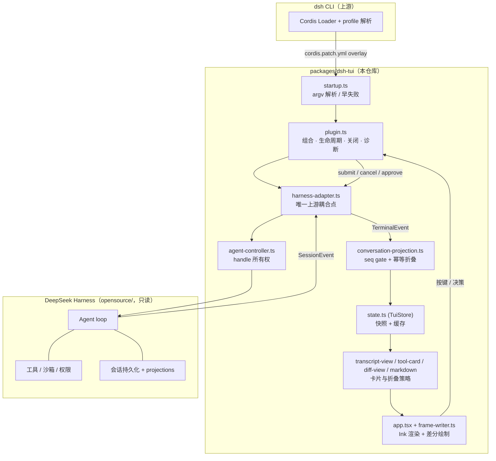
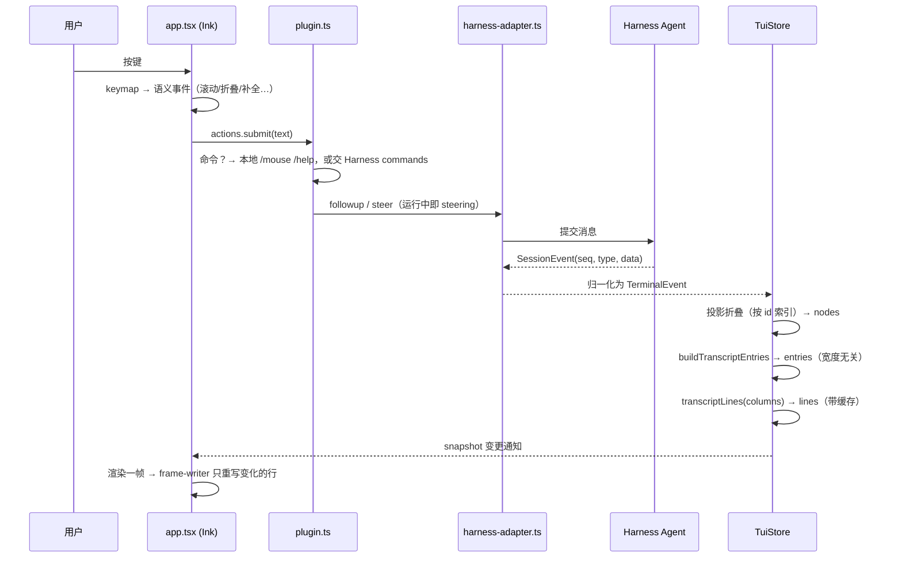

# dsh-code-agent

**DeepSeek Harness TUI** —— 一个键盘优先的终端 Code Agent 界面。它不是第二个 Agent：
每一次模型调用、工具调用、权限决策与会话写入都走 DeepSeek Harness 运行时，终端只负责
**把发生的事情画出来**，并把你的按键送回去。

```
                 ┌────────────────────────────────────────────────────────────┐
                 │  DeepSeek Harness TUI（本仓库 packages/dsh-tui）             │
                 │  渲染 · 输入 · 折叠 · 审批交互 · 终端降级                     │
                 └───────────────▲───────────────────────┬────────────────────┘
                                 │ SessionEvent 流        │ 用户意图
                 ┌───────────────┴───────────────────────▼────────────────────┐
                 │  DeepSeek Harness（opensource/，只读兼容目标）                │
                 │  Agent loop · 工具 · 权限/沙箱 · 会话持久化 · 模型服务         │
                 └────────────────────────────────────────────────────────────┘
```

- 用户手册：[`docs/tui-user-guide.md`](docs/tui-user-guide.md)
- 验证矩阵：[`docs/phase-0-compatibility-matrix.md`](docs/phase-0-compatibility-matrix.md)
- 架构决策：[`docs/adr/0001-external-tui-adapter-boundary.md`](docs/adr/0001-external-tui-adapter-boundary.md)
- 子包说明：[`packages/dsh-tui/README.md`](packages/dsh-tui/README.md)
- 变更记录：[`CHANGELOG.md`](CHANGELOG.md)

---

## 1. 项目介绍

### 它是什么

`dsh-code-agent` 是一个 **独立的 Harness profile**（外置 bundle），用 Ink 5 + React 18
在终端里渲染一个完整的编码 Agent 会话：流式回答、工具卡片、diff、审批、提问、会话恢复、
命令面板、会话浏览器。它以 `packages/dsh-tui` 的形式独立存在，**不修改**
`opensource/deepseek-harness` 与 `opensource/cordis`——上游是只读的应用基础设施与兼容目标。

### 它不做什么

- 不复制 Agent loop、工具实现、权限模型、沙箱与持久化语义——这些永远归 Harness 所有。
- 不引入 Web 客户端运行时（Host / 浏览器协议 / 前端状态库）。
- 不在上游 checkout 里插入源码补丁——通过 `cordis.patch.yml` 这层 overlay 挂载。

### 关键特性

| 面向 | 能力 |
|---|---|
| 阅读 | 流式回答、**真正的 markdown 渲染**（标题/粗斜体/删除线/链接/列表/引用/分隔线/对齐表格/代码围栏）、按行折行（CJK 逐字断行）、resize 全量重排 |
| 工具 | 语义化工具卡片（run/edit/search/read/fetch 着色）、diff 逐行着色、长输出自动折叠、Code Mode 子调用缩进、`⚠ interrupted` 未完成调用 |
| 交互 | 审批瀑布（`y`/`n`）、结构化提问表单、命令补全 `/`、路径补全 `@`、命令面板 `Ctrl+P`、会话浏览器 `Ctrl+R`、草稿历史、steering（运行中发消息直接改向当前 run） |
| 终端 | 能力探测（truecolor / ANSI / 无色、Unicode / ASCII 退化）、alternate screen、**差分帧绘制**（不整屏擦除，无闪烁）、鼠标滚轮翻页、tmux/SSH 探测与降级 |
| 工程 | 严格 TypeScript 6、`fast-check` 属性测试、PTY 真机冒烟矩阵、性能与内存预算、上游契约漂移门禁、打包产物离树安装验证 |

---

## 2. 快速开始

### 环境要求

- Node `^22.19.0 || >=24.0.0`（已验证 22.23.2 / 24.14.0）
- pnpm 11.7.0（`packageManager` 已固定，用 corepack 即可）
- 一个真正的 TTY：`stdin` 与 `stdout` 都必须是终端；重定向运行会非零退出并提示改用
  `--profile headless`

### 安装

```bash
pnpm install

# 让 dshcodecli 在任意目录可用（二选一）
pnpm link --global --dir packages/dsh-tui   # 或：npm link，在 packages/dsh-tui 下执行
```

不想装全局命令也可以，仓库内 `pnpm dshcodecli -- <args>` 或
`node packages/dsh-tui/bin/dshcodecli.mjs <args>` 完全等价。

### 启动

```bash
# 一次性任务（跑完即退出）
dshcodecli "修复登录模块的竞态并跑相关测试"

# 交互式会话（跑完保持开启，可继续追问）
dshcodecli -i "review the working tree"

# 恢复上一个会话
dshcodecli -i --resume latest

# 用完即弃的会话目录
DSH_HOME=$(mktemp -d) dshcodecli -i "解释这个仓库的架构"
```

**工作目录就是工作区**：agent 读写的是你敲命令时所在的目录，所以在哪个项目里就在哪个项目里起。

`dshcodecli` 会在 `$DSH_HOME/profiles/tui`（默认 `~/.dsh`）里创建 profile、软链本包，
再启动真实的 `dsh` CLI，并按所在位置自动选一种模式：

| 模式 | 何时命中 | 怎么跑 |
|---|---|---|
| dev | 命令解析到本仓库内（含 `pnpm link` 的全局命令） | 以 `--conditions=development` 从 `src/*.ts` 直接运行仓库里 vendored 的上游 CLI |
| installed | 其他情况 | 找已安装的 `dsh`（`DSH_CLI` → 依赖里的 `@deepseek-ai/dsh` → `PATH`），跑本包编译后的 `lib/*.js` |

设置 `DSH_CLI=<dsh 入口>` 可强制走 installed 模式并指定用哪个 CLI。

### 凭据与代理

启动时按下面的顺序找 `.env`，**逐个变量**取第一个提供它的文件（不是整文件二选一）：

1. 当前目录，再逐级向上到文件系统根 —— 项目根放一份，项目内任意子目录都能用；
2. dev 模式下的仓库根；
3. `$DSH_HOME/.env`（默认 `~/.dsh/.env`）—— **想让任意目录都能用，就写这里**。

```
DEEPSEEK_API=<key>          # 也认 DEEPSEEK_API_KEY
DEEPSEEK_URL=<base url>     # 也认 DEEPSEEK_BASE_URL，缺省 https://api.deepseek.com
```

```bash
umask 077 && printf 'DEEPSEEK_API_KEY=sk-…\n' >> ~/.dsh/.env   # 设一次，全局生效
```

已经导出的同名环境变量优先，`.env` 不会覆盖它。逐变量分层是有意的：只写了
`DEEPSEEK_BASE_URL` 的项目级 `.env` 不会因此挡住 `~/.dsh/.env` 里唯一的那把 key。
三处都没有 key、`$DSH_HOME/.credentials.yaml` 也没有时，`dshcodecli` 会在 TUI 占屏之前
直接告诉你该往哪个文件写，而不是等第一轮对话报 `MISSING_CREDENTIAL`。检测到 `HTTP(S)_PROXY` 时会补
`NODE_OPTIONS=--use-env-proxy`（Node 内置 fetch 默认不读代理变量）；该 flag 是 Node 24
才有的，Node 22 下改为打印一行提示而不是让进程起不来。

### 发布到 npm（Ubuntu / Windows 11 / macOS 通用）

```bash
# 1. 先登录（交互式，脚本里做不了）
npm login --registry https://registry.npmjs.org

# 2. 空跑：打包 + 校验 + 走完所有发布前检查，但不上传
pnpm run publish:npm

# 3. 真发
pnpm run publish:npm -- --yes
```

`publish:npm` 会在上传前依次挡下四类最常见的翻车，每一条都直接给出该敲的命令：

| 检查 | 为什么 |
|---|---|
| registry 不是只读镜像 | 配了 `registry.npmmirror.com` 的机器发不了包，而且报错发生得很晚 |
| 版本号没被占用 | npm 不允许覆盖已发布版本，unpublish 只有 72 小时窗口 |
| 已登录目标 registry | 登录镜像 ≠ 登录 npm，所以用 `--registry` 显式校验 |
| 工作区干净（`--allow-dirty` 跳过） | 从未提交的改动打出来的包，事后无法从 tag 复现 |

发完还会回读一次 registry 确认真的能取到，而不是只信 `npm publish` 的退出码。
常用开关：`--tag next` 发预览版、`--otp <code>` 走 2FA、`--skip-build` 复用 `dist/` 里已有的
tarball、`--name @你的scope/dshcodecli` 换名字。只想要 tarball 不发布，仍然用
`pnpm run package:npm`（它按设计永远不上传）。

用户侧就一条命令，三个平台完全一样：

```bash
npm install -g dshcodecli
cd /path/to/project && dshcodecli -i "..."
```

脚本对工作区包做三处改动（改在临时拷贝上，不动源码树）：包名换成 **`dshcodecli`**、去掉
`private`、把 `@deepseek-ai/dsh` 加成正式依赖（所以用户装一次就带上了 CLI，不用自己再装）。

包名之所以不能直接沿用 `@deepseek-ai/dsh-tui`：那个名字是 **bundle 身份**——`cordis.patch.yml`
按它 import 自己，`prepareProfile` 也按它把目录软链进 profile；同时它属于 DeepSeek 的 npm
组织，你发不上去。发成 `dshcodecli` 两边都不冲突：npm 把目录装成 `node_modules/dshcodecli`，
profile 仍按绝对路径把它链成 `@deepseek-ai/dsh-tui`。`--name @你的scope/dshcodecli` 可换名字。

**三平台通用是因为这个包本身是纯 JavaScript**，所有原生依赖都在 `@deepseek-ai/dsh` 里，由
npm 在每台机器上各自解析成匹配的平台变体——和离线包被构建机绑死正相反。

脚本发布前会把 tarball 真装进一个临时工程验一遍：`@deepseek-ai/dsh` 有没有跟着装进来、
`--version` 是不是 installed 模式、`--help`、非 TTY 拒绝。它**不会替你 publish**。

已知的平台差异都在启动器里处理了：Windows 用 junction 代替软链、`dsh.cmd` shim 走 shell
启动（Node 从 2024 年起不允许直接 spawn 批处理文件）、`PATH` 按 `;` 切分并试 `.cmd/.exe`。
但只在 Linux 上实测过——Win11 / macOS 的实机验证按你的选择留到发布后按反馈修。

### 部署到另一台机器（在线安装，不发布）

目标机器能上 npm 时，走这条最省事——不用离线包，也没有平台绑定问题（每台机器各自装匹配自己
平台的原生依赖）。

先在本仓库打一个 tarball（约 200 KiB）：

```bash
pnpm run build:lib
cd packages/dsh-tui && npm pack --pack-destination /tmp
scp /tmp/deepseek-ai-dsh-tui-0.1.0.tgz user@server:~
```

然后在目标机器上二选一：

```bash
# 全局装，命令直接进 PATH
npm install -g @deepseek-ai/dsh@0.1.0-rc.7 ~/deepseek-ai-dsh-tui-0.1.0.tgz
cd /path/to/project && dshcodecli -i "..."

# 或者装进某个项目，用 npx 调
npm install @deepseek-ai/dsh@0.1.0-rc.7 ~/deepseek-ai-dsh-tui-0.1.0.tgz
npx dshcodecli -i "..."
```

`@deepseek-ai/dsh` 必须一起装：本包是 profile，不是 CLI 本身；启动器按
`DSH_CLI` → 依赖里的 `@deepseek-ai/dsh` → `PATH` 三级找它，上面两种装法都命中第二级。
本包 `private: true` 只挡 `npm publish`，不影响 `npm pack` 与从 tarball 安装；要省掉 scp
这一步就把 tarball 发到内网 registry，或者直接 `npm i -g <git+ssh URL>`。

npm 11 会对 `node-pty` 等包的 install 脚本打印 `allow-scripts` 警告——不用管，这些包自带
prebuilt 二进制，实测装完能正常跑（跑过一次真实会话：读文件、调模型、退出码 0）。

凭据与代理和别处一样：在**运行命令的目录**放 `.env`，或自己 export。

### 打包分发（离线自包含）

```bash
pnpm run package:offline
# → dist/dshcodecli-0.1.0/          解压即用的目录（约 218 MiB）
# → dist/dshcodecli-0.1.0.tar.gz    分发用压缩包（约 51 MiB）
```

产物里带着本 profile、上游 `dsh` CLI 与两者的全部运行时依赖。**目标机器只需要 Node
≥22.19，不需要联网、不需要 npm**。解压后 `./dshcodecli -i "..."`（Windows 用 `dshcodecli.cmd`）。

**包是「构建机的平台」专用的**：`dsh` 的闭包里有 6 个带编译产物的包（ripgrep、sharp、koffi、
landlock、`node-addon-require-builtin` 等），它们是按平台拆分的 optional dependency，
`npm install` 只会装匹配当前机器的那一份。换平台（或 musl libc，比如 Alpine）要在那边重新跑一次
本脚本。具体装了哪些平台包记在 `MANIFEST.json` 的 `nativePackages` 里，包内 `README.txt`
也会列出来。

构建机需要能访问 npm：闭包是用一次真实的 `npm install --omit=dev` 装出来的。注意包里带的是
**已发布的 `@deepseek-ai/dsh`**（默认 `0.1.0-rc.7`），不是仓库钉死的 `rc.5`——rc.5 从未发布，
而 vendored checkout 目前构建不出来（上游 `build:lib:host` 在自己的打包步骤上失败）。
脚本会驱动打好的产物做一次自检，具体版本记在包内 `MANIFEST.json` 里。
`--dsh <version>` 可换版本，`--no-verify` / `--no-archive` 可跳过自检与压缩。

### 打包分发（单文件可执行）

```bash
pnpm run package:sea
# → dist/dshcodecli-0.1.0-linux-x64   单个可执行文件（约 167 MiB）
```

把上面的离线包整体塞进一份 Node 二进制（Node SEA），**目标机器连 Node 都不需要**，拷过去
`./dshcodecli-0.1.0-linux-x64 -i "..."` 即可。首次运行会把内嵌的运行时解到
`$XDG_CACHE_HOME/dshcodecli/<版本>`（可用 `DSHCODECLI_RUNTIME` 改位置）并打上完成标记，之后
直接复用；Harness 要通过真实目录解析 profile，这一步省不掉。

产物按 **构建机的平台与架构** 命名，跨平台需要拿目标平台的 `node` 传给 `--node <path>`
（macOS 目标必须在 macOS 上构建，否则签名过不了）。`dist/` 里没有离线包时脚本会先自动构建它，
也可以用 `--bundle <dir>` 指向已有的；`--no-verify` 跳过自检。

已知取舍：`NODE_OPTIONS` 只在进程启动时生效，而这里 CLI 是在同一个进程里跑的，所以当需要加
`--use-env-proxy`（检测到 `HTTP(S)_PROXY` 且 Node ≥24）时，可执行文件会带着该变量重启自己一次。

### 保留的旧入口

| 入口 | 现在等价于 |
|---|---|
| `pnpm tui -- <args>` | `dshcodecli <args>` |
| `./scripts/run-tui.sh <args>` | `dshcodecli --interactive <args>` |
| `dsh --profile tui <args>` | 上游原生写法，`dshcodecli` 就是它的包装 |

### 命令行

| Flag | 含义 |
|---|---|
| `[task...]` | 首条消息。未给 `--resume` 时必填 |
| `-i, --interactive` | 首个任务结束后保持会话 |
| `--resume [session]` | 按 session id、可辨识前缀或 `latest` 恢复 |
| `--permission <preset>` | `read-only` / `workspace-write`（默认）/ `danger-full-access` |
| `--model <route>` | `provider/model[:reasoning-effort]`，仅本次运行生效 |
| `--alternate-screen` | 使用备用屏缓冲，退出时还原 |
| `--no-color` | 关闭语义色（同样识别 `NO_COLOR`、`TERM=dumb`） |
| `--diagnostic-log <path>` | 追加脱敏 JSONL 诊断日志，默认关闭 |

非法取值一律在 **进入 raw mode 之前** 失败。

### 常用按键（完整列表见用户手册）

| 键 | 作用 |
|---|---|
| `Enter` / `Ctrl+Enter` | 发送 / 换行 |
| `Esc` | 先清草稿；无可清时两段式取消当前运行 |
| `PgUp` / `PgDn` / 鼠标滚轮 | 滚动 transcript（向上滚会暂停跟随并显示未读数） |
| `Tab` | 接受补全，否则在 composer 与 transcript 之间切换焦点 |
| `/` `@` `?` | 命令补全 / 路径补全 / 快捷键速查表 |
| `Ctrl+P` / `Ctrl+R` | 命令面板 / 会话浏览器 |
| `Ctrl+O` / `Ctrl+X` | 折叠或展开工具卡 / 在 `$EDITOR` 打开卡片首个文件位置 |
| `Shift+Tab` | 轮换权限预设 |

---

## 3. 架构设计

### 3.1 分层



### 3.2 一次输入到一帧的数据流



关键点：

- **上游事件 → TerminalEvent → TranscriptNode → TranscriptEntry → TranscriptLine** 是一条
  单向管线。前两级与终端宽度无关，最后一级才引入 `columns`，因此 resize 只重算最后一级，
  流式 delta 也只重算被触碰的那一条 entry。
- **投影是幂等的**：事件按 `seq` 单调闸门通过，重复投递按结构指纹去重；出现 gap、冲突或
  未知的 required 事件时，transcript **暂停并给出诊断**，而不是显示半截历史。
- **渲染是差分的**：`frame-writer.ts` 截获 Ink 的写出，逐行比对上一帧，只重写真正变化的行，
  不做整屏 `ESC[2K` 擦除——这是「spinner 跑起来就闪屏」的根因修复。也因此终端自身的
  scrollback 里永远没有会话内容，滚轮必须走应用内视口（`viewport.ts`）。

### 3.3 边界规则（由测试强制）

| 规则 | 强制方式 |
|---|---|
| 只有 `harness-adapter.ts` 可以提到上游 checkout 或 `@deepseek-ai/*` | `tests/isolation.spec.ts` 扫描全部源码 |
| 非 `.tsx` 模块不得 import React / Ink | 同上 |
| 不得直接依赖或 import Cordis | `check:release` |
| 上游 commit / 版本 / session format / 12 项服务契约固定 | `upstream-compat.json` + `check:upstream` |

上游更新的标准动作是：跑 `npm run check:release`，通过则更新基线，失败则**保留旧基线继续可用**。

---

## 4. 核心模块

### 4.1 目录

```
dsh-code-agent/
├─ packages/dsh-tui/          # 独立 TUI 包（唯一产品代码）
│  ├─ src/                    # 45 个模块，见下表
│  ├─ tests/                  # 42 个 spec：单测 / 属性 / 故障注入 / 真实 plugin 组合
│  ├─ completions/            # bash / zsh / fish 补全
│  └─ cordis.patch.yml        # 外置 bundle overlay（含 read-only 预设补齐）
├─ scripts/                   # 门禁与真机脚本（PTY 冒烟、soak、bench、release gate）
├─ docs/                      # 用户手册 / 兼容矩阵 / ADR
├─ opensource/                # 上游只读 checkout（Harness + Cordis）
└─ upstream-compat.json       # 已验证的上游与工具链基线
```

### 4.2 模块职责

| 模块 | 职责 |
|---|---|
| `startup.ts` | argv 解析与校验，进入 raw mode 之前失败 |
| `plugin.ts` | 组合全部部件、生命周期、受控关闭、诊断日志、本地命令派发 |
| `harness-adapter.ts` | **唯一上游耦合点**：优先 import 已安装 `@deepseek-ai/dsh-*`，开发环境回退固定源码 checkout；归一 Agent / SessionEvent / 审批瀑布 / commands / questions / tool presentation |
| `agent-controller.ts` | 上游中立的 handle 所有权：create / resume / followup / steer / 定型 cancel / whenIdle / flush / 恰好一次 teardown |
| `conversation-projection.ts` | seq 闸门 + 幂等折叠（按 id 索引，无线性扫描），gap / 重复冲突 / unknown-required 检测 |
| `state.ts` | `TuiStore`：事件追加、快照发布、entry/line 双层缓存、保留窗口 |
| `transcript-view.ts` | 节点 → 条目 → 行，折叠策略与行预算 |
| `tool-card.ts` / `diff-view.ts` / `tool-presentation.ts` | 按工具自报的 render intent 渲染卡片、徽章与逐行着色 diff |
| `markdown.ts` | 助手正文的 markdown 渲染：消费语法、只留样式，表格按显示宽度对齐；**逐行 1:1**、行内 `segments` 拼接等于 `text` |
| `terminal-text.ts` / `terminal-capabilities.ts` / `terminal-layout.ts` | 终端安全（escape/控制符清洗）、能力探测、行预算与折行 |
| `keymap.ts` / `input-router.ts` / `composer.ts` / `draft-completion.ts` | 按键语义化、输入路由、草稿编辑与 `/`、`@` 补全 |
| `approval-queue.ts` / `question-queue.ts` / `question-form.ts` | 审批与结构化提问的排队、渲染与失败关闭（`unavailable` 视为拒绝） |
| `viewport.ts` / `mouse.ts` | 应用内视口滚动与 SGR 鼠标滚轮解析 |
| `frame-writer.ts` | 差分帧绘制，消除整屏擦除引起的闪烁 |
| `activity.ts` / `status-line.ts` / `todo-panel.ts` / `working-line.ts` | 状态行、上下文压力条、goal/todo 面板、运行中提示 |
| `session-selector.ts` / `session-browser.ts` / `history-store.ts` | 恢复候选解析、全屏会话浏览器、跨会话草稿历史 |
| `theme.ts` / `glyphs.ts` / `styling.ts` / `brand.ts` / `splash.ts` | 配色分级、Unicode/ASCII 字形集、样式段模型、品牌图与开屏 |
| `shutdown.ts` / `diagnostic-log.ts` | 有界关闭序列与脱敏诊断 |
| `app.tsx` / `render-boundary.tsx` | Ink 渲染与区域级错误边界 |

### 4.3 值得注意的三条不变量

1. **markdown 逐行 1:1**：渲染输出行数恒等于源行数——`transcript-view.ts` 用第 0 行做 header、
   其余按下标配到 detail，折叠计数也用 `detail.length`，行数一变就会错位。表格分隔行因此
   渲染成 `─┼─` 横线而不是被删掉。
2. **行内自洽**：`segmentText(segments) === line.text`，否则折行与样式会脱节。
3. **线性成本**：正文每来一个 token 就整段重渲染，因此有 `MAX_SOURCE_LENGTH`(20k) 与
   `isPlainText` 快路径，表格另有行数与宽度上限。

---

## 5. 开发与验证

### 5.1 门禁命令

```bash
pnpm build                   # 严格 TypeScript（tsc -p tsconfig.json）
pnpm test                    # 单元 / 投影 / 属性 / 边界 / 故障注入
pnpm run check               # 完整门禁（下列除 release 外全部）
pnpm run check:release       # 发布门禁；-- --fast 为快跑

pnpm run check:upstream      # 上游 tuple 与 12 项服务契约漂移
pnpm run check:profile       # 真实 Harness Loader 组合 profile
pnpm run check:cli           # dshcodecli：help / 非 TTY 拒绝 / 非法预设 / installed 接线
pnpm run check:interactive   # PTY 四场景：80x24 审批 / 160x50 resize / 80x12 提问 / Unicode 粘贴
pnpm run check:resume        # 新建 → 退出 → --resume latest → 续跑
pnpm run check:cancel        # 取消与信号路径
pnpm run check:bench         # 性能与内存预算
pnpm run check:packed        # 打包产物离树安装并启动
pnpm run check:soak:quick    # 10 秒耐久；check:soak 为 30 分钟
pnpm run check:node22        # Node 22 运行时矩阵
pnpm run check:real          # 真实 DeepSeek API 一次性任务（密钥取自环境或 .env）
pnpm run check:real:interactive / check:real:approval
pnpm run build:lib           # 生成发布用 lib/
```

### 5.2 性能预算（`check:bench` 的硬上限）

| 场景 | 预算 |
|---|---|
| 1 000 事件重建到首屏 | 300 ms |
| 10 000 事件重建到首屏 | 1 500 ms |
| 100 000 事件重建到首屏 | 15 000 ms |
| 2 000 事件逐条实时追加 | 4 000 ms |
| 10 MB 单条工具输出成卡 | 400 ms |
| 100 个乱序完成的并行工具调用配对 | 500 ms |
| 10k 事件会话稳态 RSS | 200 MB |

### 5.3 测试策略

- **属性测试**（`fast-check`）：seed/live 投影等价、重复投递幂等、gap 检测、工具配对、
  保留上限；以及对任意二进制串的终端安全性——不泄漏 escape/控制符、折行与截断永不越过列预算。
- **真实组合测试**：13 个测试驱动真正的 plugin/store/queue/controller/adapter（只替换渲染器），
  覆盖退出码 0/1/74/130、取消、SIGTERM、stdin EOF、监听器清理、会话切换、steering。
- **PTY 真机冒烟**：用 `node-pty` 起真实进程，把差分写出重放进行缓冲模型再断言屏幕内容。

> 已知不稳定项：`check:interactive` 的 `--question`（80×12）场景在本机约 1/3 概率卡在
> `Working…` 超时，`HEAD` 上同样复现，与近期改动无关，待单独排查。

---

## 6. 权限与安全

| 预设 | 文件 | 审批 |
|---|---|---|
| `read-only` | 只读 | 其余一律需要审批 |
| `workspace-write`（默认） | 工作区内可写 | 更大范围需要审批 |
| `danger-full-access` | 不受限 | 不再询问 |

- composer 提示符按预设着色：`danger-full-access` 红、`read-only` 青。
- 切到 `danger-full-access` 需要**连续发送两次**同一条命令，第一次只打印警告。
- 没有「全部允许」键。终端无法作答时（拆机、abort、渲染器崩溃）请求被答为 `unavailable`，
  Harness 视其为拒绝。
- 诊断日志全程脱敏：凭据变 `[redacted]`，提示词/工具参数/文件内容/命令输出变 `[N chars]`。

---

## 7. 平台支持与当前限制

| 平台 | 级别 |
|---|---|
| Linux / macOS | 发布目标平台 |
| Windows（Windows Terminal + ConPTY） | CI 验证：审批、提问、resize、备用屏、恢复、30 分钟耐久 |
| 旧版 Windows console | 启动时给降级提示；resize 与 Unicode 支持受限 |
| tmux / screen | 已探测；关闭 OSC 超链接与剪贴板透传 |
| SSH | 已探测；`$EDITOR` 在远端启动 |
| `TERM=dumb` / `NO_COLOR` | 无色、无备用屏 |

限制：

- `Ctrl+X` 以 detached 进程打开编辑器，适合 GUI/远程编辑器；需要接管 TTY 的终端编辑器不在范围内。
- `Home` / `End` 未绑定（Ink 5 会把它们解析成一个随后被清空的键名），由 `Ctrl+A` / `Ctrl+E` 承担。
- 鼠标只接管滚轮；接管期间原生拖选需要按住 `Shift`，`/mouse` 可把滚轮交还终端。
- 暂无图像协议、PTY 面板、右侧 activity 面板与会话全文搜索。
- 内置 profile 注册需上游 `PROFILE_TEMPLATES` 配合；本仓库按 ADR 0001 只用外置 bundle。

---

## 8. 许可与第三方

产品代码为 MIT。复用的第三方素材与出处记录在
[`THIRD_PARTY_NOTICES.md`](THIRD_PARTY_NOTICES.md)。`opensource/` 下的上游 checkout 保持其
各自许可，本仓库不修改它们。
